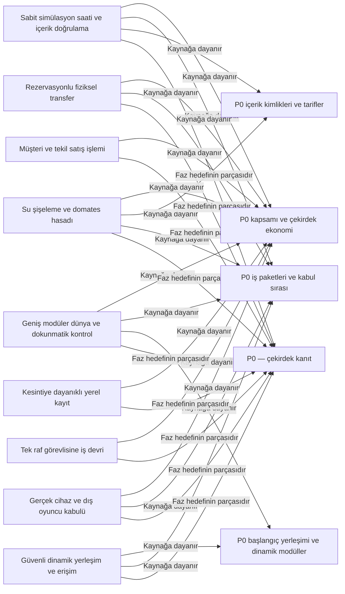

# Orbit Market — Ontoloji

Revizyon: 258. Canlı görünüm için `ontology` komutunu çalıştır.

## Türler ve özellikler

### Ürün kaynağı (`source_doc`)

- file: file; zorunlu; seçenekler: None
- section: string; zorunlu; seçenekler: None
- scope_note: string; zorunlu; seçenekler: None
### Faz hedefi (`milestone`)

- phase: string; zorunlu; seçenekler: ['P0', 'A2', 'A3', 'A4', 'A5']
- outcome: string; zorunlu; seçenekler: None
- status: string; zorunlu; seçenekler: ['planned', 'in_progress', 'accepted']
### Oynanış kabiliyeti (`capability`)

- phase: string; zorunlu; seçenekler: ['P0', 'A2', 'A3', 'A4', 'A5']
- behavior: string; zorunlu; seçenekler: None
- status: string; zorunlu; seçenekler: ['planned', 'in_progress', 'implemented', 'verified']

## İlişki kuralları

- Kaynağa dayanır (`grounded_in`): capability → source_doc; kaynak başına 1..çok, hedef başına 0..çok; etki: reverse
- Faz hedefinin parçasıdır (`part_of`): capability → milestone; kaynak başına 1..1, hedef başına 0..çok; etki: none

## Somut nesneler

- **P0 kapsamı ve çekirdek ekonomi** (`constitution-p0`, source_doc): {"file": "OYUN_GELISTIRME_DEVIR_DOSYASI.md", "scope_note": "P0 ürün kapsamı, ilk döngü, sabit tick ve teknik/görsel sınırlar.", "section": "§26, §58.1, §60–63"}; durum: input; üretici: dış girdi
- **P0 iş paketleri ve kabul sırası** (`mvp-guide-p0`, source_doc): {"file": "MVP_IMPLEMENTATION_GUIDE.md", "scope_note": "P0 uygulama adımları ve beklenen davranışlar; henüz uygulanmış oldukları anlamına gelmez.", "section": "P0 sahnesi, P0-01…P0-09"}; durum: input; üretici: dış girdi
- **P0 içerik kimlikleri ve tarifler** (`content-catalog-p0`, source_doc): {"file": "OYUN_SISTEMLERI_VE_ICERIK_KATALOGU.md", "scope_note": "Kaynak, üç su SKU'su, taze domates, istasyon ve açılış sarfları.", "section": "§2, §7, §26 ile eşlenen içerik"}; durum: input; üretici: dış girdi
- **P0 başlangıç yerleşimi ve dinamik modüller** (`world-map-p0`, source_doc): {"file": "DUNYA_YERLESIM_PLANI.md", "scope_note": "100×100 m başlangıç dünyası; P0 satış 12×12 m, bahçe 12×16 m; standart modül 12×12, minimum oda 8×8 ve geçit 4 m. Modül kaydı harita sınırını büyütür, mevcut kimlik/koordinatları korur; açık mahalle ve üretim alanları ortak modül sözleşmesiyle eklenir.", "section": "§1–4, §9, §13.1–13.2"}; durum: input; üretici: dış girdi
- **P0 — çekirdek kanıt** (`p0-core`, milestone): {"outcome": "Telefonda 3–8 dakikalık su/domates üretim ve satış döngüsü; işi devretme, kayıt/yükleme ve görünür yerleşim etkisi.", "phase": "P0", "status": "planned"}; durum: input; üretici: dış girdi
- **Sabit simülasyon saati ve içerik doğrulama** (`p0-time-content`, capability): {"behavior": "100 ms sabit tick, seed'li rastgelelik, para temsili ve kararlı içerik kimlikleriyle geçerli tarif/içerik denetimi.", "phase": "P0", "status": "planned"}; durum: current; üretici: P0-01
- **Geniş modüler dünya ve dokunmatik kontrol** (`p0-world-input`, capability): {"behavior": "100×100 başlangıç dünyasında 12×12 standart ve en az 8×8/4 m artışlı kapalı oda, açık mahalle ve üretim modülü kaydedilir; alan sınırı modül eklendikçe büyür, aktif komşular 4 m eşleşen kapıyla bağlanır, eski koordinatlar korunur. P0'da satış odası 12×12, üretim bahçesi 12×16'dır; UI pointer sahipliğiyle dokun-git/joystick çalışır.", "phase": "P0", "status": "implemented"}; durum: current; üretici: P0-02
- **Rezervasyonlu fiziksel transfer** (`p0-transfer`, capability): {"behavior": "Oyuncu veya görevli ürünü gerçek kaynak konumundan kapasitesi uygun hedefe taşır; iptal ve yinelenen komut stok çoğaltmaz.", "phase": "P0", "status": "planned"}; durum: current; üretici: P0-03
- **Müşteri ve tekil satış işlemi** (`p0-sales`, capability): {"behavior": "Tek müşteri davranışı raftaki gerçek stoğu alır, kasada bir kez satış/ledger sonucu üretir ve kuyruk durumunu korur.", "phase": "P0", "status": "planned"}; durum: current; üretici: P0-04
- **Su şişeleme ve domates hasadı** (`p0-production`, capability): {"behavior": "Çeşme suyu, ambalaj ve tohum lotları tarif/kapasite kurallarıyla üç su ürünü ve taze domatese dönüşür; bekleme nedeni görünürdür.", "phase": "P0", "status": "planned"}; durum: current; üretici: P0-05
- **Kesintiye dayanıklı yerel kayıt** (`p0-save`, capability): {"behavior": "Snapshot ve kritik işlem günlüğüyle kayıt/yükleme ekonomik işlemi bir kez korur; pause/background simülasyonu ilerletmez.", "phase": "P0", "status": "planned"}; durum: current; üretici: P0-06
- **Tek raf görevlisine iş devri** (`p0-worker`, capability): {"behavior": "Bir raf ikmal görevi gerçek yük/rota/rezervasyonla tamamlanır; kesinti veya yeniden yüklemede yük kaybolmaz.", "phase": "P0", "status": "planned"}; durum: current; üretici: P0-07
- **Güvenli dinamik yerleşim ve erişim** (`p0-placement`, capability): {"behavior": "Yerleşim önizlemesi etkin modül kimliğine göre oda sınırı ve gezinme alanını alır; footprint, servis hücresi, kapı, kasa ve taşıma yolunu denetler. İptal state değiştirmez; dinamik dünya genişlemesi mevcut raf koordinatını kaydırmaz.", "phase": "P0", "status": "implemented"}; durum: current; üretici: P0-08
- **Gerçek cihaz ve dış oyuncu kabulü** (`p0-device-acceptance`, capability): {"behavior": "Android/iOS cihaz kayıt ve dokunma döngüsü ile dış oyuncunun yardımsız çekirdek döngüyü tamamlaması gerçek kanıtla doğrulanır.", "phase": "P0", "status": "planned"}; durum: needs_review; üretici: P0-09

## Nesne haritası

Oklar kayıtlı ilişki yönüdür; değişiklik etkisinin yönü üstte ayrıca tanımlıdır.

## Görevlerin veri bağları

- **P0-01 — Sabit simülasyon saati, seed ve içerik doğrulayıcı temelini kur**: girdiler [constitution-p0, mvp-guide-p0, content-catalog-p0], çıktılar [p0-time-content], durum done.
- **P0-02 — Tek oda dünyasını, dokunmatik hareketi ve pointer sahipliğini kur**: girdiler [constitution-p0, mvp-guide-p0, world-map-p0], çıktılar [p0-world-input], durum done.
- **P0-03 — Kapasite ve rezervasyon korumalı ürün transferini kur**: girdiler [constitution-p0, p0-time-content, p0-world-input], çıktılar [p0-transfer], durum done.
- **P0-04 — Tek müşteri, raf, kuyruk ve satış ledger akışını kur**: girdiler [constitution-p0, content-catalog-p0, p0-transfer], çıktılar [p0-sales], durum done.
- **P0-05 — Üç su tarifini ve domates hasadını gerçek girdiyle çalıştır**: girdiler [constitution-p0, mvp-guide-p0, content-catalog-p0, p0-transfer], çıktılar [p0-production], durum done.
- **P0-06 — Snapshot, kritik işlem günlüğü ve lifecycle dönüşünü kur**: girdiler [constitution-p0, mvp-guide-p0, p0-time-content], çıktılar [p0-save], durum done.
- **P0-07 — Tek raf görevlisinin ikmal işini güvenli devretmesini sağla**: girdiler [constitution-p0, p0-transfer, p0-production, p0-save], çıktılar [p0-worker], durum done.
- **P0-08 — İnşa ve yerleşimde servis, kapı ve temel üretim erişimini koru**: girdiler [mvp-guide-p0, world-map-p0, p0-transfer, p0-worker], çıktılar [p0-placement], durum done.
- **P0-09 — P0 döngüsünü gerçek cihazda ve dış oyuncuyla kabul et**: girdiler [constitution-p0, mvp-guide-p0, p0-world-input, p0-transfer, p0-sales, p0-production, p0-save, p0-worker, p0-placement], çıktılar [p0-device-acceptance], durum review.

Etki yeniden inceleme ihtiyacıdır; nesnenin yanlış olduğu hükmü değildir.
