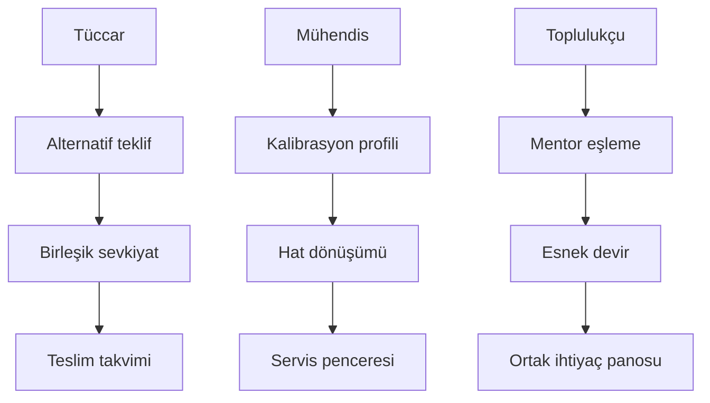
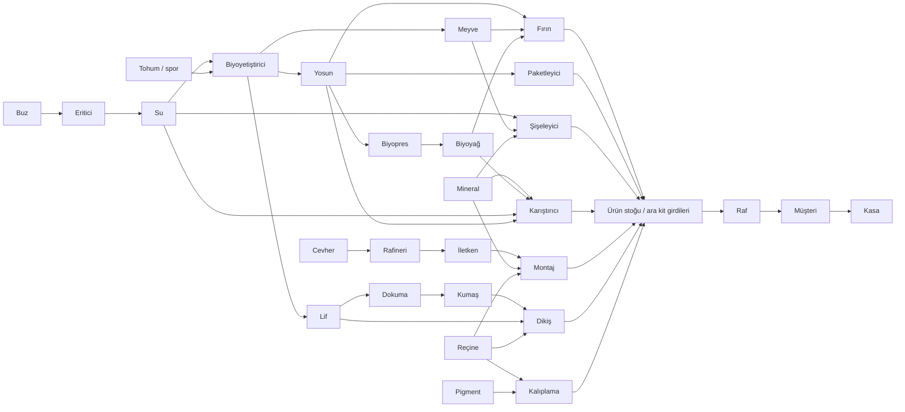

# Orbit Market — ayrıntılı oyun sistemleri ve içerik kataloğu

Tarih: 26 Eylül 2026. Bağlayıcı kaynak: [OYUN_GELISTIRME_DEVIR_DOSYASI.md](OYUN_GELISTIRME_DEVIR_DOSYASI.md), sürüm 3.0. Bu dosya yetenek, üretim, personel ve diğer oynanış kataloglarını tek yerde toplar; anayasayı değiştirmez, çalışan oyun veya uygulanmış içerik iddiası taşımaz.

**Okuma kuralı:** “kaynak §…” başlıklı alt bölümler ana dosyanın ilgili bölümünden aktarılmıştır. Bu aktarımlardaki “bölüm 27” gibi atıflar ana dosyanın numaralarıdır, bu kataloğun numaraları değildir. “Açık tanım” ve “uygulama kontrolü” metinleri eksik bilgi veya doğrulama notudur; yeni beceri, tarif, ücret veya bonus eklemez. Kaynak değişirse ilgili aktarım yeniden karşılaştırılır; bağımsız ikinci denge kaynağı oluşturulmaz.

## İçindekiler

1. Kapsam ve öncelik kuralları
2. Yetenek ağacı, XP ve araştırma
3. Ekipman ve enerji
4. Üretim şeması, bütün tarifler ve makineler
5. Kaynak maliyetleri ve 24 ürünün ekonomik tablosu
6. Personel rolleri, kökenleri, özellikleri ve örnek kadro
7. Yorgunluk, vardiya, eğitim ve personel olayları
8. Yerleşim, odalar ve işlevsel dekorasyon
9. Depo, tedarikçi, stok politikaları ve bozulma
10. Müşteri profilleri, fiyat ve ürün ikamesi
11. Bakım ve kontratlar
12. Dünya olayları
13. İlerleme, topluluklar, kriz ve üç final
14. İşletme teşhisi ve kurtarma
15. Tanımlanmamış içerikler ve veri aktarım kontrolü

## 1. Kapsam ve öncelik kuralları

| Geliştirme fazı | Bu katalogdan kullanılacak kapsam |
|---|---|
| P0 | İki makine/tek küp hattı, tek raf görevlisi, temel taşıma/raf/kasa; prototip dolabı; RPG ve gerçek ekonomi dengesi yok |
| A2 | Üç ürün/üç makine, bir çalışan, iki koltuklu mola köşesi, tek tedarikçi/depo rafı, üç müşteri profili, bir ikame; bozulma yok |
| A3 | Dokuz çekirdek yetenek, araştırma, kalite, bakım, kontrat, vardiya/oda etkileri, sınırlı olaylar |
| A4 | 24 ürün, gerekli tam içerik, üç final; kalan 21 yetenek ancak gerçek tasarımı tamamlandıktan sonra |
| A5 | Denge, cihaz, erişilebilirlik, kayıt göçü ve yayın doğrulaması |

Kaynak §58.1 ve §63.2'dir. Oyun bölümü 1–6 ile geliştirme fazı P0–A5 birbirinden ayrıdır. Tarifin “Bölüm” değeri en erken oyun erişimidir; tarifin P0'da uygulanacağı anlamına gelmez.

Öncelik notları:

- Yetenekler için eski §10'daki “ilk dilimde dal başına iki beceri” ifadesi yerine §47.1 ve §58 kapsamı kullanılır: P0/A2'de tam RPG yok, A3'te dokuz çekirdek davranış vardır.
- Lot muhasebesinde §34.4 ve §48.1 esas alınır: SKU ortalama maliyeti rapordur, gerçek satış maliyeti lot bazlıdır. Eski stok yeni fiyatla yeniden değerlenmez.
- İlk sürüm personel üst sınırı **20** olarak §27.1'de açıkça tanımlıdır. A2/P0 tek görevli kapsamı bu üst sınırla karıştırılmaz. Yan belgede bunun kaynaksız olduğu yazıyorsa bu yorum kullanılmaz.
- Genel yerleşim §9'da **1 m grid, varsayılan 6×6 oda, en az 2 hücre bağlantı koridoru** olarak tanımlıdır. P0 sahne denemesi bu genel değerleri kaynakta yokmuş gibi sunamaz.
- Taşıma takımı §47.4'te **6→8→10→12** tanımlıdır. Prototip test fixture'ı bu ürün değerini sessizce değiştiremez.
- Standart kaynak/kalite/fiyat değerleri başlangıç denge hipotezidir; aritmetik doğrulama keyif veya pazar kanıtı değildir.
- Ücretli kozmetikler hiçbir işlevsel değeri değiştirmez. Reklam/IAP ayrıntısı [MONETIZATION_AND_PRIVACY.md](MONETIZATION_AND_PRIVACY.md), uygulama/kanıt disiplini [IMPLEMENTATION_RULES.md](IMPLEMENTATION_RULES.md) içindedir.

## 2. Yetenek ağacı, XP ve araştırma

Aşağıdaki şema yalnız kaynakta belirlenmiş önkoşul zincirlerini gösterir. Her dalın kalan yedi düğümü tanımlanmamıştır; yeni isim veya bonus üretilmemiştir.



İkinci/üçüncü düğümün önkoşulu kesindir; kaynak yalnız ilk düğümün 1 puan bedelini açıkça belirtir. Diğer bedelleri otomatik 1 veya artan 2/3 puan varsayma. Tam ağacın hedefi 30 düğüm ve 19 kazanılabilir puandır; ileri düğümlerin ad/bedel/önkoşulu açık tanımdır.

### XP ve uzmanlık — kaynak §47.1

Seviye 1 başlangıçtır; sonraki seviyenin XP bedeli `100+25×(mevcutSeviye−1)`, en fazla seviye 20. Her seviye atlama 1 beceri puanı: toplam 19. İlk farklı SKU satışı 20 XP, her gün ilk 20 gerçek satış 2'şer XP, sonraki satışlar 0 XP fakat normal gelir; ilk kontrat 50, sonraki kontrat 20; ilk otomasyon/servis/sevkiyat öğretimi 30'ar; bölüm geçişi 100 XP. XP geçiş kapısı değildir, oyuncu düşük seviyede de finale ulaşabilir.

Her dalın 10 düğümü üç temel eylem ve yedi ileri varyanttan oluşur. Bu sürüm yalnız aşağıdaki 9 davranış düğümünü uygulama şartı yapar; kalan 21 düğüm A4 içerik backlog'udur, adı belirsiz bonuslarla otomatik doldurulmaz. 19 puan/30 düğüm hedefi tam ağaç tamamlanınca geçerlidir; A2/A3'te kullanılmayan puanlar saklanır.

| Dal | Düğüm | Davranış | Bedel/sınır |
|---|---|---|---|
| Tüccar | Alternatif teklif | Normal kontratta önceden tanımlı bir alternatif ürün seç | Adet/değer değişimi teklif önizlemesinde |
| Tüccar | Birleşik sevkiyat | Aynı tedarikçinin iki siparişini tek taşıma ücretine birleştir | Geç teslimat tarihi ve toplam 40 birim sınırı |
| Tüccar | Teslim takvimi | Bir kontratı iki planlı tarihe böl | Toplam ödül artmaz; rezervasyon sürer |
| Mühendis | Kalibrasyon profili | Standart/özenli üretim modu | Özenli +10 kalibrasyon, süre +%15 |
| Mühendis | Hat dönüşümü | Farklı tarif için güvenli kuyruk şablonu kaydet | Girdi/çıktı uyumluluğu kontrol edilir |
| Mühendis | Servis penceresi | Bir hat için toplu planlı bakım penceresi | Tüm hattı aynı anda durdurmaz |
| Toplulukçu | Mentor eşleme | Deneyimli çalışanı bir acemiyle eşleştir | Mentor aktif iş hızı −%5, öğrenci XP +%15 |
| Toplulukçu | Esnek devir | Çalışanın ikinci rolüne mola öncesi görev devri | İkinci rol eğitimi gerekli |
| Toplulukçu | Ortak ihtiyaç panosu | İki topluluğun mevcut tekliflerini tek planda birleştir | Ödül/ürün taahhüdü iki kez sayılmaz |

Her dalın ilk düğümü 1 puan; ikinci ilkini, üçüncü ikinciyi ister. Manuel olarak yapılabilen temel işlemler beceri arkasında kilitlenmez; düğümler toplu yönetim ve alternatif iş akışı sağlar. Yeniden dağıtma ilk kez ücretsiz, sonra 100 kredi; açık kontrat kazanımlarını geri almaz ve yeni bonus üretmez. Artık uygun olmayan otomasyon profili güvenle manuel moda döner.

### Araştırma kazanımı ve harcaması — kaynak §46.3

Başlangıç gıda/içecek paketi ücretsizdir. Temizlik, enerji, tekstil ve dekor temel paketlerinin her biri 2 AP; altı ailenin ileri paketi ayrı ayrı 2 AP. Toplam katalog araştırma bedeli 20 AP. Bölüm 1→2, 2→3, 3→4 ödülleri toplam 13 AP. Her ailenin ilk 10 gerçek müşteri satışında bir kez +1 AP: en fazla 6. Günde ilk normal kontratı tamamlamak +1 AP verir; 20 AP toplam kazanıma erişene kadar bu kaynak sürer. Böylece yanlış sırada araştırma harcaması ilerlemeyi kilitlemez. Aynı SKU ailesi kendi kendine al-sat ile ilerletilemez.

Temel paket o ailede bölüm 2–3 ürünlerini; ileri paket bölüm 4 ürünlerini açar. Gıda/içecek bölüm 1 tarifleri ücretsiz, aynı ailedeki bölüm 2–3 ürünleri bölüm erişimiyle açılır. Bir ileri paket ancak temel paket açıkken alınır. Aile tanıtım öğretimi ilk yeni aile paketi içinde gösterilir. AP ödülü yalnız bir kez yazılır ve yeniden dağıtılan beceriler AP üretmez.

### Yetenek uygulama kontrolü

| Düğüm | Yanlış uygulanmaması gereken sınır |
|---|---|
| Alternatif teklif | Her SKU birbirine dönüşmez; kontratın tanımlı alternatifi ve önizlenen oran kullanılır |
| Birleşik sevkiyat | Daha erken ücretsiz teslim veya 40 birim üzeri kapasite yaratmaz |
| Teslim takvimi | İki tarih iki ayrı tam ödül doğurmaz |
| Kalibrasyon profili | +10 kalibrasyon doğrudan +10 nihai kalite değildir; süre bedeli korunur |
| Hat dönüşümü | Uyumlu olmayan girdiler kaybolmaz veya yeni ürüne ücretsiz çevrilmez |
| Servis penceresi | Hattın bütün makinelerini aynı anda otomatik durdurmaz |
| Mentor eşleme | Mentorun −%5 aktif hız bedeli korunur; öğrenci XP'si AP değildir |
| Esnek devir | İkinci rol eğitimi ve güvenli yük/rezervasyon devri gerekir |
| Ortak ihtiyaç panosu | İki teklif aynı lot veya ödülü iki kez sayamaz |

Eğitici özelliğinin +%10 XP'si, Akademi kökeninin +%10'u ve Mentor düğümünün +%15'inin birleşme/üst sınır politikası kaynakta açık değildir. Kendiliğinden çarpıp bileşik bonus oluşturma; uygulamadan önce karar kaydı gerekir.

## 3. Ekipman ve enerji

### Ekipman alanının sınırı — kaynak §47.4

Taşıma takımı 6→8→10→12 birim; yükseltme bedelleri 80/160/300 kredi. 12'lik ağır modda hareket −%8, kullanıcı önceki hafif modu seçebilir. Analiz aracı işletme haritasını açan ücretsiz görev ödülüdür; temel teşhis ücretli ekipman gerektirmez. Üretim aparatı kalibrasyon profili için görsel araçtır, bağımsız üst üste bonus katmanı değildir. Böylece ekipman, beceri, dekor ve kalite aynı avantajı dört kez çarpmaz.

### Güç kapasitesi ve öncelik — kaynak §47.3

Başlangıç bağlantısı 8 E; ek enerji modülü 200 kredi ve +8 E, 2×2 hücre, bölüm 3'te açılır. Temel öğretim makineleri 1+2+1=4 E, yani başlangıç sistemi yeterlidir. Kullanım bedeli bölüm 26'daki E×saniye×0,01; kapasite satın almak bu bedeli kaldırmaz. Modül sayısı harita alanıyla sınırlıdır.

Güç dağıtımı varsayılan soğuk depo → aktif parti → öncelikli yeni parti → diğer makineler. Bir işi başlatmadan gerekli E ayrılır. Kesintide düşük öncelikli işler kalan süreyi koruyarak durur; aynı öncelikte eski iş önce gelir. Oyuncu önceliği değiştirir, güç yetersizliği haritada açıklanır. Şebeke olayı mevcut dış kapasiteyi değiştirir, doğrudan stok silmez.

## 4. Üretim şeması, bütün tarifler ve makineler

Kaynak §26.1: sekiz ham kaynak buz, spor, meyve tohumu, lif tohumu, cevher, mineral, reçine ve pigmenttir. Yedi ara ürün su, yosun, meyve, lif, biyoyağ, iletken ve kumaştır. Miktarlar birim/paket, süreler parti başınadır. Enerji bedeli `E × aktif saniye × 0,01 kredi`; birim üretim maliyeti `(girdi maliyeti + parti enerji + sarf) / çıktı adedi`. Personel/oda sabit giderleri ikinci kez ürün maliyetinden düşülmez. Güncel lot muhasebesi bu kataloğun depo/muhasebe bölümündedir.

**Kimlik ayrımı:** `item.water` ara sudur; `item.drinking_water` nihai içme suyudur. Tarif kimliği `recipe.*`, ürün kimliği `item.*` biçimindedir. Tablo satırındaki kısa ID tam namespace ile kullanılır. P0'nun sağladığı ara su, ücretsiz nihai içme suyu satışı eklemek anlamına gelmez.

### Ara üretim tarifleri — kaynak §26.2

| Tarif ID | Girdi | Araç | Süre | Çıktı |
|---|---|---|---:|---|
| water | 1 buz | Eritici | 4 sn | 2 su |
| algae | 1 su + 1 spor | Biyoyetiştirici | 10 sn | 4 yosun |
| fruit | 2 su + 1 meyve tohumu | Biyoyetiştirici | 14 sn | 3 meyve |
| fiber | 1 su + 1 lif tohumu | Biyoyetiştirici | 12 sn | 3 lif |
| oil | 3 yosun | Biyopres | 8 sn | 2 biyoyağ |
| conductor | 2 cevher | Rafineri | 12 sn | 2 iletken |
| cloth | 2 lif | Dokuma tezgâhı | 10 sn | 1 kumaş |

Tam kimlik biçimi `recipe.water`, `item.water` şeklindedir. Aşağıdaki tarifler katalogdaki 24 nihai üründür. Satış fiyatları Standart kalite için başlangıç hedefidir; fiyat/maliyet doğrulamasından sonra ayarlanır.

### Nihai ürün kataloğu — kaynak §26.3

| ID / ürün | Bir parti girdisi | Araç | Süre | Çıktı | Birim fiyat | Bölüm |
|---|---|---|---:|---:|---:|---:|
| nutrient_cube / Besin küpü | 2 yosun | Paketleyici | 8 sn | 1 | 12 | 1 |
| algae_cracker / Yosun krakeri | 3 yosun + 1 biyoyağ | Fırın | 12 sn | 2 | 15 | 2 |
| fruit_bar / Meyve barı | 2 meyve + 1 yosun | Fırın | 14 sn | 2 | 18 | 3 |
| expedition_ration / Sefer öğünü | 2 besin küpü + 1 meyve | Paketleyici | 12 sn | 1 | 40 | 4 |
| drinking_water / İçme suyu | 1 su | Şişeleyici | 4 sn | 1 | 5 | 1 |
| nebula_drink / Nebula içeceği | 1 su + 1 meyve | Şişeleyici | 8 sn | 1 | 14 | 2 |
| mineral_drink / Mineral içeceği | 2 su + 1 mineral | Şişeleyici | 10 sn | 2 | 12 | 3 |
| festival_nectar / Festival nektarı | 3 meyve + 1 su | Şişeleyici | 14 sn | 2 | 24 | 4 |
| basic_cleaner / Temizleyici | 1 mineral + 1 biyoyağ | Karıştırıcı | 8 sn | 2 | 14 | 2 |
| bio_soap / Biyosabun | 1 biyoyağ + 1 su | Karıştırıcı | 6 sn | 2 | 10 | 2 |
| filter_gel / Filtre jeli | 2 mineral + 1 yosun | Karıştırıcı | 10 sn | 1 | 24 | 3 |
| care_kit / Bakım seti | 1 temizleyici + 1 biyosabun | Paketleyici | 8 sn | 1 | 32 | 4 |
| home_battery / Ev pili | 1 iletken + 1 mineral | Montaj masası | 12 sn | 1 | 24 | 2 |
| work_lamp / Çalışma lambası | 1 ev pili + 1 reçine | Montaj masası | 14 sn | 1 | 36 | 3 |
| portable_charger / Taşınır şarj cihazı | 2 iletken + 1 reçine | Montaj masası | 16 sn | 1 | 38 | 3 |
| power_kit / Enerji bakım kiti | 1 ev pili + 1 taşınır şarj cihazı | Paketleyici | 12 sn | 1 | 72 | 4 |
| thermal_gloves / Termal eldiven | 1 kumaş | Dikiş istasyonu | 10 sn | 1 | 20 | 2 |
| work_apron / İş önlüğü | 2 kumaş | Dikiş istasyonu | 14 sn | 1 | 42 | 3 |
| insulated_bag / Yalıtımlı çanta | 2 kumaş + 1 reçine | Dikiş istasyonu | 16 sn | 1 | 50 | 3 |
| expedition_coat / Sefer ceketi | 3 kumaş + 1 lif | Dikiş istasyonu | 20 sn | 1 | 65 | 4 |
| habitat_ornament / Habitat süsü | 1 reçine + 1 pigment | Kalıplama ünitesi | 8 sn | 1 | 18 | 2 |
| color_panel / Renkli panel | 2 reçine + 1 pigment | Kalıplama ünitesi | 10 sn | 2 | 16 | 3 |
| soft_cushion / Yumuşak minder | 1 kumaş + 1 lif | Dikiş istasyonu | 10 sn | 1 | 28 | 3 |
| glow_ornament / Işıklı süs | 1 habitat süsü + 1 iletken | Montaj masası | 14 sn | 1 | 36 | 4 |

Ürün fiyatlarının maliyet üzerinde olduğu varsayılmaz: içerik doğrulayıcı her tarif için kârlılık raporu çıkarır. Bölüm 11'deki 4 kredi besin küpü maliyeti tasarım hedefidir, bu reçetelerden bağımsız sabit gerçek değildir. Aynı satılabilir ürün ileri tarifte girdi olabilir; raf ve üretim stoğu için rezervasyon önceliği seçilir.

### Üretim araçları — kaynak §26.4

| Araç | Fiyat | Alan | Güç E | Girdi/çıktı tamponu | İşlev |
|---|---:|---|---:|---|---|
| Eritici | 100 | 1×2 | 1 | 12/24 | Buzdan su |
| Biyoyetiştirici | 160 | 2×2 | 1 | 16/24 | Yosun, meyve, lif |
| Biyopres | 180 | 1×2 | 2 | 12/12 | Biyoyağ |
| Rafineri | 260 | 2×2 | 3 | 16/16 | İletken |
| Dokuma tezgâhı | 220 | 1×2 | 2 | 16/12 | Kumaş |
| Paketleyici | 180 | 1×2 | 2 | 24/12 | Gıda ve kitler |
| Fırın | 240 | 2×2 | 3 | 16/16 | İşlenmiş gıda |
| Şişeleyici | 160 | 1×2 | 1 | 16/16 | İçecek |
| Karıştırıcı | 200 | 1×2 | 2 | 16/16 | Temizlik |
| Montaj masası | 280 | 2×2 | 2 | 16/12 | Enerji ve ileri dekor |
| Dikiş istasyonu | 240 | 1×2 | 1 | 16/12 | Tekstil |
| Kalıplama ünitesi | 220 | 2×2 | 2 | 16/16 | Dekor |

Her araç için erişilebilir en az bir servis hücresi gerekir. Seviyeler: I temel; II %15 kısa işlem süresi ve +%10 satın alma bedeli kadar yükseltme maliyeti; III ikinci tarif kuyruğu ve +%25 yükseltme maliyeti. Bu ilk denge hipotezidir. Paralel ücretsiz üretim eklenmez; tarif kuyruğu aynı makineyi sırayla kullanır. Yükseltme krediyledir, gerçek parayla alınamaz.

### Üretim şeması — kaynak §26.5



Şema aile düzeyindedir; ürünler arası kit girdilerinin kesin yönü tarif tablosudur. Yeniden kullanılan nihai ürünler işlem sırasına göre çözülür; tarif grafiği döngü içermemelidir.

### Otomasyon, kalite ve kapasite — kaynak §26.6

Üretim emri: Ürün, hedef stok, minimum stok, öncelik, maksimum ayrılmış girdi. Stok minimuma düştüğünde hedefe kadar parti açılır. Kullanılabilir stok = fiziksel stok − rezerve stok. Çalışan bir taşıma işini alınca hem kaynak hem hedef kapasite rezerve edilir; iptalde ikisi de bırakılır.

Hat kapasitesi = en düşük aşama kapasitesi; makine çıktısı/dakika = çıktı adedi × 60 / parti süresi. Tek paketleyici besin küpünde 7,5 adet/dakika üretir. Girdilerin ve taşımaların bunu karşılaması gerekir. Öğretimde oyuncuya daha fazla makine almak yerine darboğazı görmesi öğretilir.

Kalite skoru = 0,5 × miktar ağırlıklı girdi kalite skoru + 0,3 × kalibrasyon + 0,2 × personel uzmanlığı; sonuç 0–100'e sınırlandırılır. Standart <60, Nitelikli 60–84, Özel ≥85. Personelsiz makinede uzmanlık 40 alınır. Kaynak kalitesi ve kalibrasyon ilerlemesi bölüm 47'de tanımlıdır. Fiyat çarpanları 1 / 1,15 / 1,30; yüksek kalite talebi müşteri bütçesiyle sınırlıdır. Sonsuz kaliteli stok satışı garanti edilmez.

### Kaliteye ulaşılabilir yol — kaynak §47.2

Ham kaynak kalite skoru Standart 40, Nitelikli 70, Özel 95; alış bedeli çarpanı 1/1,25/1,60. Nitelikli kaynak bölüm 3, Özel kaynak bölüm 4'te aynı tedarikçide açılır. Yüksek kaliteli kaynak zorunlu değil, sınırlı yüksek bütçeli talebi hedefleyen seçimdir. Normal nihai toptan ürünler 40/70/95 skoruyla ve 1/1,15/1,30 fiyat çarpanıyla sunulur; üst kalite günlük SKU kotasının en fazla %25'idir.

Makine kalibrasyonu seviye I=40, II=70, III=90. Mühendisin özenli modu +10, en fazla 100; bu nedenle Özel kalite yalnız bu sınıfa bağlı değildir: girdi95 + makine90 + uzmanlık80 →90,5 ve Özel kalite. Becerisiz otomasyonda girdi40 + makine40 + personelsiz40 →40 ve Standart. Birden çok aşamada gerçek skor lot boyunca korunur; kademe etiketi yeni 95 skoruna dönüşmez. Titiz özelliği son skora +5 ekler, sonuç100 sınırını aşmaz.

Personel becerisi 60 aktif görev saniyesi başına +1, eğitim odasında 120 sn ve 20 krediyle +3; günlük toplam gelişim en fazla +8 puan. Günlük ücret artışı yalnız bildirilen terfi/sözleşme kararıyla olur. Kalite uzmanlığı ilgili üretim becerisidir; kasiyer hizmeti yanlışlıkla makineye kalite vermez.

### Altı ürün ailesi — §26.3 katalog gruplaması

| Aile | Dört nihai ürün ID'si |
|---|---|
| Gıda | nutrient_cube, algae_cracker, fruit_bar, expedition_ration |
| İçecek | drinking_water, nebula_drink, mineral_drink, festival_nectar |
| Temizlik | basic_cleaner, bio_soap, filter_gel, care_kit |
| Enerji | home_battery, work_lamp, portable_charger, power_kit |
| Tekstil | thermal_gloves, work_apron, insulated_bag, expedition_coat |
| Dekor | habitat_ornament, color_panel, soft_cushion, glow_ornament |

Yumuşak minderin Dikiş istasyonunda üretilmesi onun katalog ailesini otomatik Tekstil yapmaz. Tarif makinesi ve ürün ailesi farklı alanlardır. Mermaid şeması aile düzeyindedir; kesin miktar/bağımlılık için tarif tablosu kullanılır. Kalite “Nitelikli 60–84” ifadesi sürekli skor için 60≤skor<85 olarak uygulanır; 84,5 puan arada kalmaz.

## 5. Kaynak maliyetleri ve 24 ürünün ekonomik tablosu

### Ortak hesap kuralları — kaynak §37.1

Bu bölüm fiyat ve maliyetler için güncel başlangıç referansıdır. Değerler test hipotezidir; aritmetik doğrulama oynanış dengesinin doğrulanması değildir. Standart kalite, seviye I makineler ve sübvansiyonsuz enerji esas alınır. Personel, bakım ve oda giderleri aşağıdaki değişken maliyetlerden ayrıdır. Ambalaj sarfı ilk sürümde 0'dır; eklenirse bütün tarif ağacı yeniden hesaplanır.

| Ham kaynak | Teslim dahil birim maliyet | Tedarik |
|---|---:|---|
| Buz | 2,00 | Yerel kaynak noktası |
| Spor | 6,56 | Kooperatif |
| Meyve tohumu | 6,00 | Kooperatif |
| Lif tohumu | 4,00 | Kooperatif |
| Cevher | 5,00 | Sanayi dağıtıcısı |
| Mineral | 4,00 | Sanayi dağıtıcısı |
| Reçine | 3,00 | Bölgesel toptancı |
| Pigment | 2,00 | Bölgesel toptancı |

Nihai ürün normal toptan bedeli referans perakendenin %65'idir. Nakliye 5 kredi/sipariş, sipariş kapasitesi 40 birimdir. Tablo 10 birimlik siparişte birim 0,50 taşıma kullanır; gerçek miktar ve bölüm 33 hacim indirimi işlemde hesaplanır. Referans perakende fiyatı oyuncunun raf fiyatından bağımsızdır; fiyat şişirerek tedarik veya kontrat değeri artırılamaz.

### Ürün tablosu — kaynak §37.2

Ara ürün maliyetleri yuvarlanmadan sonraki tarife taşınır. Ekran iki ondalık, ledger en az dört ondalık sabit hassasiyet kullanır; ödeme toplamı en küçük para birimine yuvarlanır. Katkı sabit gider öncesidir, net kâr değildir.

| Ürün | Üretim maliyeti | Referans satış | Üretim katkısı | Toptan alış | Dış alım katkısı* |
|---|---:|---:|---:|---:|---:|
| Besin küpü | 4.00 | 12.00 | 8.00 | 7.80 | 3.70 |
| Yosun krakeri | 4.54 | 15.00 | 10.46 | 9.75 | 4.75 |
| Meyve barı | 3.90 | 18.00 | 14.10 | 11.70 | 5.80 |
| Sefer öğünü | 10.97 | 40.00 | 29.03 | 26.00 | 13.50 |
| İçme suyu | 1.06 | 5.00 | 3.94 | 3.25 | 1.25 |
| Nebula içeceği | 3.83 | 14.00 | 10.17 | 9.10 | 4.40 |
| Mineral içeceği | 3.07 | 12.00 | 8.93 | 7.80 | 3.70 |
| Festival nektarı | 4.67 | 24.00 | 19.33 | 15.60 | 7.90 |
| Temizleyici | 3.56 | 14.00 | 10.44 | 9.10 | 4.40 |
| Biyosabun | 2.05 | 10.00 | 7.95 | 6.50 | 3.00 |
| Filtre jeli | 10.12 | 24.00 | 13.88 | 15.60 | 7.90 |
| Bakım seti | 5.77 | 32.00 | 26.23 | 20.80 | 10.70 |
| Ev pili | 9.42 | 24.00 | 14.58 | 15.60 | 7.90 |
| Çalışma lambası | 12.70 | 36.00 | 23.30 | 23.40 | 12.10 |
| Taşınır şarj cihazı | 13.68 | 38.00 | 24.32 | 24.70 | 12.80 |
| Enerji bakım kiti | 23.34 | 72.00 | 48.66 | 46.80 | 24.70 |
| Termal eldiven | 3.73 | 20.00 | 16.27 | 13.00 | 6.50 |
| İş önlüğü | 7.39 | 42.00 | 34.61 | 27.30 | 14.20 |
| Yalıtımlı çanta | 10.41 | 50.00 | 39.59 | 32.50 | 17.00 |
| Sefer ceketi | 12.79 | 65.00 | 52.21 | 42.25 | 22.25 |
| Habitat süsü | 5.16 | 18.00 | 12.84 | 11.70 | 5.80 |
| Renkli panel | 4.10 | 16.00 | 11.90 | 10.40 | 5.10 |
| Yumuşak minder | 5.44 | 28.00 | 22.56 | 18.20 | 9.30 |
| Işıklı süs | 10.62 | 36.00 | 25.38 | 23.40 | 12.10 |

*Dış alım katkısı taşıma dahil, hacim indirimsizdir. İleri tarifte girdi olarak kullanılan satılabilir ürünün maliyeti raf fiyatı değil lot maliyetidir. Vazgeçilen satış katkısı ayrı fırsat maliyetidir.

Kontrol: su=(2+0,04)/2=1,02; yosun=(1,02+6,56+0,10)/4=1,92; küp=2×1,92+0,16=4,00. Bu değerler bölüm 11'deki küp maliyeti hedefini karşılar. Kalite bonusları, olaylar ve verim yükseltmeleri sapma olarak raporlanır.

### Talep, gider ve büyüme çerçevesi — kaynak §37.3

| Bölüm | Baz ziyaret/gün | Ortalama ihtiyaç satırı/ziyaret | Satılan birim hedefi/gün | Personel hedefi |
|---|---:|---:|---:|---:|
| 1 | 56 | 1,0 | 35–50 | 0–1 |
| 2 | 80 | 1,4 | 70–95 | 1–3 |
| 3 | 110 | 1,6 | 115–150 | 3–5 |
| 4 | 140 | 1,8 | 170–215 | 5–8 |
| 5+ | 160 | 2,0 | 215–270 | 6–10 |

İhtiyaç sayısı dağılımları: bölüm 2 bir satır %60/iki satır %40; bölüm 3 bir %40/iki %60; bölüm 4 bir %40/iki %40/üç %20; bölüm 5 bir %25/iki %50/üç %25. Her ihtiyaç bir birim ürün ister. Ziyaret satış garantisi değildir. 900/56≈16,1 sn başlangıç müşteri aralığıdır.

Aile ihtiyaç ağırlıkları gıda %30, içecek %25, temizlik %15, enerji %12, tekstil %10, dekor %8. Kilitli aileler çıkarılıp kalanlar normalize edilir. Ürünlerin aile içi başlangıç ağırlıkları eşittir; needTags uyumluluğu uygulanır. Yüksek marjlı tekstilin sınırlı talebi, bütün marketi cekete çevirmenin otomatik üstünlüğünü engeller.

İlk satış odası günlük kira 0; ek her oda günlük 4 kredi altyapı gideri. Personel ücretleri bölüm 27; soğutma enerji gideri bölüm 33; bakım fiilen yapıldığında giderleşir. Bakım için ayrılan kredi rezervi ikinci bir gider değildir.

Örnek bölüm 2 planı: 30 küp + 30 su + 15 Nebula satışının üretim katkısı 510,80; raf görevlisi 60 + kasiyer 65 + üç ek oda 12 =137 sabit gider; bakım/fire öncesi 373,80 kredi sonuç. Bu gerçekleşmiş veya garantili satış değil, hedef senaryodur.

Temel yükseltme için bölüm 2'de 1–3 sağlıklı oyun günü; büyük oda+hat yatırımı için bölüm 4'te 3–6 gün birikim hedeflenir. Makine bedeli bölüm 26'dır. Hedef tutmazsa önce ziyaret, sepet ve kapasite ölçülür. Fiyatlar oyuncunun nakdine göre gizlice değiştirilmez.

Üretim kararı için metrik: beklenen satılabilir katkı / darboğaz makine dakikası. Satılmayacak sınırsız çıktı hesaba katılmaz. Dış alım daha düşük katkı karşılığında makine zamanı kazandırır; stokta bağlı kredi ve raf ömrü iki yol için de değerlendirilir.

## 6. Personel rolleri, kökenleri, özellikleri ve örnek kadro

Kaynak §27: yerel tipler oyun evrenindeki yerleşim geçmişleridir; gerçek etnik köken/milliyet performans kalıbı değildir. Her rol her kökenden gelebilir. Sekiz rol × altı köken = 48 arketip; bunlar 48 benzersiz model veya 48 zorunlu isimli karakter değildir.

### Meslekler — kaynak §27.1

| Rol | Görev | Ana beceri | Başlangıç günlük ücret | Başarı ölçümü |
|---|---|---|---:|---|
| Raf görevlisi | Raf ikmali ve stok kontrolü | Lojistik | 60 | Boş raf süresi |
| Kasiyer | Tahsilat ve kuyruk düzeni | Hizmet | 65 | Ortalama bekleme |
| Taşıyıcı | Kaynak, makine ve depo transferi | Lojistik | 65 | Başarılı teslim/dk |
| Üretim operatörü | Tarif kuyruğu ve kalibrasyon | Üretim | 80 | Etkin üretim süresi |
| Teknisyen | Bakım ve enerji arızası | Teknik | 90 | Arıza çözüm süresi |
| Yetiştirici | Biyolojik üretim | Biyoloji | 75 | Kaynak verimi |
| Satın alma sorumlusu | Tedarik ve sipariş planı | Ticaret | 95 | Stokta bağlı kredi |
| Vardiya yöneticisi | Öncelik ve mola planı | Liderlik | 110 | Görevlerin dengeli dağılımı |

İlk çalışan raf görevlisidir; diğer roller bölüm 2–4 arasında açılır. İlk sürümde çalışan sayısı 20 ile sınırlıdır. İşe alım ekranında ücret, beceri, tercih, vardiya, görünür özellikler ve başlangıç rolü açıkça gösterilir.

### Yerleşim kökenleri — kaynak §27.2

| Yerel tip | Geçmiş | Kazanılmış özellik | Tercih / gelişim alanı |
|---|---|---|---|
| Merkez Habitat | Yoğun hizmet bölgesi | Kuyruk işlerinde +%8 hız | Düzenli vardiya tercih eder |
| Buz Limanı | Soğuk depo ve sevkiyat | Kaynak transferinde +1 yük | Hizmet eğitimiyle hızlı gelişir |
| Sera Kuşağı | Tarım yerleşimi | Biyotariflerde +5 kalite puanı | Teknik eğitim ister |
| Maden Halkası | Endüstriyel bakım bölgesi | Onarım süresinde −%8 | Sessiz mola alanı tercih eder |
| Kervan İskelesi | Ticaret ve dağıtım | Teslim planlamada +%8 hız | Değişken görevleri sever |
| Akademi Yerleşimi | Araştırma kampüsü | Eğitim XP'sinde +%10 | Uzman görev tercih eder |

Bu özellikler biyolojik değil geçmiş deneyimdir; başka kökenden çalışan aynı yeteneği eğitimle edinebilir. Tercih karşılanmayınca doğrudan beceri düşüşü verilmez; uzun vadeli memnuniyet hesabına sınırlı katkı yapar.

Her meslek için altı yerel varyant kullanılabilir: örneğin Buz Limanı kasiyeri yük avantajını taşıma görevindeyken kullanır, kasa hızına otomatik avantaj almaz. Böylece rol × köken = 48 işe alım arketipi; benzersiz sanat üretimi gerektirmeden veriyle çeşitlilik sağlanır.

### Bireysel özellikler — kaynak §27.3

Her aday: 1 meslek, 1 yerel geçmiş, 2 olumlu özellik, 1 çalışma tercihi, 1 geliştirilebilir eksiklik taşır. Çelişen özellik çiftleri oluşturulmaz; oyuncu özellikleri işe alımdan önce görür.

| Özellik | Etki | Sınır / bedel |
|---|---|---|
| Düzenli | Stok sayımı +%12 hızlı | Diğer işlere etki etmez |
| Çevik | Yürüme +%8 | Taşıma kapasitesi değişmez |
| Güçlü taşıyıcı | +2 yük | Ücret beklentisi +%5 |
| Titiz | Üretim kalite skoru +5 | İşlem süresi +%5 |
| Pratik | İşlem süresi −%6 | Kalite bonusu yok |
| Arabulucu | Takım anlaşmazlığının çözüm süresi −%20 | Vardiyada en yüksek tek etki uygulanır |
| Eğitici | Eşleştirilen acemiye +%10 eğitim XP | Aynı anda bir öğrenci |
| Çok yönlü | İkinci rolde beceri cezası yarıya iner | Birincil uzmanlık bonusu yok |
| İçe dönük çalışma tercihi | Tek istasyonda memnuniyet +3 | Kasa görevi yasak değildir |
| Yeni başlayan | Ana beceri 15–25 | Ücret −%15; eğitimle giderilir |

Performans çarpanları sınırsız çarpılmaz. Toplam hız bonusu −%25 ile +%30 arasında sınırlandırılır. Kalite ayrı hesaptır. Ücret beklentisi ve eğitim maliyeti satış kataloğuyla dengelenir.

### Örnek personel kadrosu — kaynak §27.4

| Ad | Rol / köken | Beceri | Özellikler | Kişisel olay hattı |
|---|---|---:|---|---|
| Ada | Raf görevlisi / Merkez | Lojistik 35 | Düzenli, çevik | İlk ekip liderliği |
| Bora | Kasiyer / Kervan | Hizmet 40 | Arabulucu, çok yönlü | Yerel pazar organizasyonu |
| Mira | Operatör / Akademi | Üretim 45 | Titiz, eğitici | Yeni tarif geliştirme |
| Ekin | Yetiştirici / Sera | Biyoloji 45 | Düzenli, titiz | Kuraklık dayanışması |
| Demir | Teknisyen / Maden | Teknik 50 | Pratik, eğitici | Çırak yetiştirme |
| Nil | Taşıyıcı / Buz Limanı | Lojistik 40 | Güçlü taşıyıcı, çevik | Soğuk depo iyileştirmesi |
| Aras | Satın alma / Kervan | Ticaret 45 | Pratik, arabulucu | Alternatif tedarikçi |
| Selin | Yönetici / Merkez | Liderlik 50 | Eğitici, düzenli | Adil vardiya anlaşması |

Bunlar başlangıç içerik örnekleridir, ücretli karakterler değildir. Her birinin tercih ve gelişim alanı üretim verisinde ayrıca atanır; hazır isimler rastgele adaylarla birlikte kullanılabilir.

### Çalışma ve memnuniyet modeli — kaynak §27.5

Beceriler 0–100, memnuniyet 0–100, yorgunluk 0–100. Etkin görev süresiyle yorgunluk artar; 4 dakika çalışmaya yaklaşık 1 dakika mola başlangıç hedefidir. Mola temel ihtiyaçtır ve oyuncu tarafından tamamen kapatılamaz; çalışanlar sırayla dinlenir.

```text
gunlukMemnuniyetDegisimi = clamp(
    ucretUyumu + molaUyumu + ortam + tercihUyumu + olaySonucu,
    -8, +6)
etkinHiz = temelHiz × clamp(1 + beceriBonusu + ozellikBonusu - yorgunlukCezasi, 0.75, 1.30)
```

Memnuniyet iki gün 30 altında kalırsa görüşme isteği, daha sonra düzelmezse önceden bildirilen ayrılma süreci oluşur. Çalışan stok veya para çalmaz. Ayrılırken rezervasyonlarını bırakır ve işi güvenli kuyruğa döner. Eğitim günlük zaman ve kredi kullanır; yeni yetenek gerçek çalışma deneyimiyle kazanılır.

### Aday üretimi için doldurulması gereken kayıt

Her adayın rolü, kökeni, ilgili becerileri, iki olumlu özelliği, çalışma tercihi, geliştirilebilir eksikliği, ücreti ve vardiyası işe alımdan önce görünür olmalıdır. İsimli örneklerin eksik tercih/eksiklik alanı bu tablolarla tamamlanmış sayılmaz. Çelişen özellik çiftlerinin listesi, aday çekim ağırlıkları, beceri bonusunun eğrisi, ikinci rolün temel cezası ve eksikliklerin tam kataloğu kaynakta eksiktir; açık tanım listesine alınır.

Özellik etkisi yalnız tanımlı görevde uygulanır: Buz Limanı kasiyerinin yük avantajı tahsilatı hızlandırmaz; Düzenli her üretime %12 hız vermez; Güçlü taşıyıcı rol adı değil özelliktir. “Yeni başlayan” olumlu özellik slotu değildir, geliştirilebilir eksikliktir. “İçe dönük” çalışma tercihi kasa yasağı değildir.

## 7. Yorgunluk, vardiya, eğitim ve personel olayları

Eğitim sayıları kaynak §47.2'deki kalite bölümünde de yer alır: 60 aktif görev saniyesine +1 ilgili beceri; eğitim odasında 120 sn/20 kredi →+3; günlük toplam gelişim en fazla +8. Günlük ücret artışı otomatik beceri tick'iyle yapılmaz, bildirilen terfi/sözleşme kararı gerekir.

### Durumlar ve sayısal model — kaynak §31.1

Personel durumları: OffShift → Available → Working → FinishingSafeStep → WalkingToRest → Resting → Returning. Alternatifler WaitingForStation, Training, OnLeave. Yorgunluk `F` 0–100'dür; arayüzde enerji `100−F` gösterilir. İkisi ayrı kaydedilmez. Memnuniyet uzun vadeli, yorgunluk kısa vadeli ölçüdür.

Tüm süreler çalışan simülasyonun saniyesidir: duraklatma ve çevrimdışı süre etkilemez. 1 oyun günü = 900 simülasyon saniyesi. Normal işte yorgunluk artışı `0,25/sn` olduğundan 0'dan 60'a yaklaşık 4 dakikada ulaşılır. Rahat ortamda 60'tan 15'e yaklaşık 1 dakikada dönülmesi hedeflenir.

```text
workFatigueRate = 0.25 × roleLoad × environmentLoad
roleLoad: kasa/raf=1.00, taşıma=1.15, üretim=1.05, eğitim=0.70
environmentLoad = clamp(1 + noisePenalty + crowdPenalty - ergonomicRelief, 0.85, 1.25)
F = clamp(F + workFatigueRate × dt, 0, 100)
fatigueSpeedPenalty = clamp((F - 40) / 200, 0, 0.25)
restRecoveryPerSecond = 0.55 + 0.004 × roomComfort  // comfort: 0–100
```

Diğer roller varsayılan 1,00 yük kullanır. Gürültü ve kalabalık cezaları ayrı ayrı 0–0,15; ergonomi indirimi 0–0,15'tir. Bölüm 27'nin toplam hız sınırı geçerlidir; yeni hız çarpanları zincirleme eklenmez. Yorgunluk gizli ürün kaybı, rastgele stok silme veya ödeme hatası üretmez.

### Mola kuralları ve güvenli görev bırakma — kaynak §31.2

- F ≥60: Mola talebi oluşur. Uygun koltuk ve rota rezerve edilir; ekip sırayla çıkar.
- F ≥80: Yeni iş alınmaz; mevcut iş en geç 10 saniyelik güvenli adımda bırakılır, mola ertelenemez.
- F ≤15: Normal mola tamamlanır. Kullanıcı iş yükünü azaltarak daha erken mola başlatabilir.
- Dinlenme alanına yürümek küçük yük sayılır: +0,05/sn. Koltuk beklerken güvenli alanda ayakta dinlenme −0,25/sn sağlar; koltuk yokluğu sonsuz kilit yaratmaz.
- Vardiya dışında yorgunluk −1/sn azalır. Oyun kapalıyken gerçek saate göre hesap yapılmaz.
- Molalar ücretlidir. Günlük ücret aynı simülasyon günü içinde vardiya değiştirerek tekrar tekrar tahsil edilmez veya iptal edilmez.

Kasiyer başlamış satış transaction'ını tamamlar; taşıyıcı yükünü rezerve hedefe veya güvenli ara depoya bırakır. Operatör makineyi durdurmak zorunda değildir: otomatik çalışan mevcut parti devam eder, insan gerektiren sonraki işlem bekler. Stok ve hedef rezervasyonları görev devrinde atomik aktarılır.

Mola planlayıcı kritik roller için en az bir görevli bırakmayı dener; zorunlu dinlenmeyi engellemez. Tek kasiyer dinlenirse oyuncu kasaya geçebilir veya müşteriler bilgilendirilmiş kuyrukta bekler. Sistem oyuncudan onay bekleyerek çalışanı süresiz yoramaz.

### Vardiya ve izin — kaynak §31.3

Başlangıçta tek vardiya, bölüm 3'te günün 0–450 ve 450–900 saniyelik iki zaman aralığı açılır. Bir personel bir günde en fazla 720 saniye görevde planlanır; bunun içindeki molalar korunur. Tam gün sözleşmesi atanmış vardiya içinde sabit günlük ücret, yarım gün sözleşmesi %60 ücret kullanır. Maliyeti atama ekranında gösterilir.

İzin gününde personel görev almaz; izin ücretli/ücretsiz durumu olayda açıkça yazılır. Planlayıcı aynı personeli eğitim, izin ve vardiyaya çakıştırmaz. Gün sınırı olay ve ücret işlemleri benzersiz gün kimliğiyle yalnız bir kez yürür.

### Personel arayüzü — kaynak §31.4

Çalışan kartında enerji, memnuniyet, mevcut iş, sıradaki mola, mola yeri ve yorgunluk sebepleri görünür. Personel ekranında zaman çizelgesi, dinlenme koltuğu ihtiyacı ve rol boşluğu uyarısı bulunur. Öneri örneği: “Üç çalışan aynı anda mola eşiğine geliyor; birini şimdi dinlendir veya bir koltuk ekle.”

### Personel olayları — kaynak §28

| Olay | Tetik / önkoşul | Seçenekler | Sonuç ve toparlanma |
|---|---|---|---|
| İlk gün heyecanı | Yeni işe alım | Mentor ata / kısa oryantasyon | 1 gün eğitim bonusu |
| Görev anlaşmazlığı | İki çalışan aynı öncelikte uzun süre bekler | İş alanını ayır / yönetici görüşmesi | Rota ve görev öncelikleri düzelir |
| Eğitim talebi | Beceri 40, en az 3 gün çalışma | Eğitim bütçesi / sonraki gün planı | Yeni uzmanlık; reddetmek kalıcı kilit yaratmaz |
| Fazla yük uyarısı | İki vardiya yüksek yorgunluk | Ek çalışan / görev azalt / mola düzenle | Geçici verim düşüşü çözülebilir |
| Aile izni | Bölüm 3 sonrası, önceden bildirim | İzin ve geçici atama / vardiya değişimi | 1 günlük yokluk; ücretli kriz çözümü yok |
| İyileştirme önerisi | Uzman çalışan, sık darboğaz | Deneme bütçesi / sonraya al | Uygunsa kalibrasyon planı açılır |
| Ücret görüşmesi | Terfi veya uzun süre ücret uyumsuzluğu | Zam / eğitimli yeni rol / açık erteleme | Beklenti ve memnuniyet değişir |
| Takım başarısı | Üç gün hedef hizmet kalitesi | Ortak kutlama / mola ödülü | Küçük geçici memnuniyet artışı |
| İş güvenliği uyarısı | Servis yolu sıkışık veya bakım gecikmiş | Hattı durdur / teknik kontrol | Sorunlu makine kapanır, kalıcı yaralanma sistemi yok |
| Ayrılma kararı | Uzun süre çözümsüz düşük memnuniyet | Sorunu gider / düzenli devir | Önceden bildirilen personel kaybı |

Aynı çalışanda eşzamanlı en fazla bir karar olayı. Küresel olarak iki aktif personel kararı sınırı vardır. Kişisel olaylar çalışma dışı gerçek zamanda ilerlemez. Karar beklerken oyun duraklatılabilir. Reddedilen bir teklif tekrar tekrar aynı gün çıkmaz; minimum üç oyun günü cooldown kullanılır.

## 8. Yerleşim, odalar ve işlevsel dekorasyon

### Modüler yerleşim — kaynak §9

- 1 m hücreli ızgara; varsayılan oda 6×6 hücre, bağlantı koridoru en az 2 hücre genişliğindedir.
- Modüller: Market, depo, sera, işleme, atölye, personel alanı, enerji ve topluluk alanı.
- Ekipman boyutları 1×1, 1×2, 2×2 ve 2×3; servis erişim hücreleri tanım verisinde bulunur.
- İnşa modu simülasyonu duraklatır. Yerleştirme önizlemesi fiyatı, çakışmayı, kapı ve servis erişimini gösterir.
- Modüller taşınabilir, döndürülebilir ve saklanabilir. İç eşya, envanter ve bağlantılar kalıcı kimliklerle korunur.
- Bir taşıma işlemi önce doğrulanır, sonra tek komut olarak uygulanır. Geçersiz hareketin yarısı sahneye uygulanmaz.
- Son girişin kapanması, kasa erişiminin yok olması ve çalışanların kapalı hücreye sıkışması engellenir.
- İlk dilimde bağlantı otomatik komşulukla; sonraki aşamada okunaklı enerji ve lojistik portlarıyla kurulur.
- Geri al/yeniden yap inşa oturumu için desteklenir. Satılmış veya tüketilmiş envanter geçmişe dönük çoğaltılamaz.

Teknik yaklaşım: Izgara işgal haritası + erişilebilirlik grafiği; yerleşim değişiminde yalnızca etkilenen bölge güncellenir. İlk dilimde basit ızgara A* yeterlidir. Ajan sayısı artınca rota önbelleği ve kuyruk rezervasyonları eklenir.

### Odalar — kaynak §32.1

Oda türü duvar, kapı, geçerli zemin alanı ve gerekli eşyalardan hesaplanır. Bütün odalar aynı taşınabilir modül sistemini kullanır; aşağıdaki 4×4 gibi boyutlar varsayılan 6×6'nın desteklenen varyantlarıdır. Fiyat yalnız oda kabuğudur; eşya maliyeti ayrı görünür.

| Oda | En küçük alan | Gerekli donanım | Kabuk bedeli | İşlev |
|---|---|---|---:|---|
| Satış alanı | 6×6 | Kasa ve raf | İlk oda ücretsiz | Müşteri alışverişi |
| Kuru depo | 4×4 | Depo rafı | 160 | Girdi ve ürün saklama |
| Personel dinlenme odası | 4×4 | En az 2 koltuk | 180 | Hızlı yorgunluk giderme |
| Soyunma/hazırlık odası | 4×4 | Dolap | 140 | Vardiya başlangıç hazırlığını 10'dan 5 sn'ye indirir |
| Eğitim odası | 4×4 | Eğitim masası | 240 | Aynı anda 2 kişiye eğitim |
| Yönetim odası | 4×4 | Planlama terminali | 280 | Vardiya ve sipariş politikaları |
| Bakım atölyesi | 4×4 | Bakım tezgâhı | 220 | Teknisyenin planlı bakım işi |
| Soğuk depo | 4×4 | Soğutucu raf ve enerji | 300 | Hassas ürünlerin ömrünü uzatır |
| Mal kabul alanı | 4×4 | Teslim portu, kontrol masası | 200 | Dış sipariş teslim alma |
| Müşteri dinlenme köşesi | 4×4 | Oturma ve yönlendirme | 160 | Bekleme konforu |

Sera, işleme, enerji ve topluluk alanları önceki modül kataloğunda kalır. A4'teki eski “8 modül tipi” üst sınırı kaldırılmıştır: bu ekle toplam 14 işlevsel oda türü hedeflenir; atölye ve bakım atölyesi aynı türdür. İlk prototip bunların tümünü içermez.

### Dekor ve donanım etkileri — kaynak §32.2

| Nesne | Oyun içi fiyat | Etki | Üst sınır |
|---|---:|---|---|
| Dinlenme koltuğu | 35 | Bir dinlenme slotu | Gerçek yerleşim ve yol erişimi |
| Kanepe | 70 | İki dinlenme slotu | Koltuk başına ayrı rezervasyon |
| Bitki | 20 | Oda konforuna +8 | İlk 2 tam, sonraki 2 yarım, sonrası 0 |
| Aydınlatma paneli | 25 | Aydınlatma alt skoruna +15 | Alt skor 100 |
| Akustik panel | 40 | Gürültü alt skoruna +15 | Alt skor 100 |
| Ergonomik çalışma tezgâhı | 80 | İlgili istasyonda yorgunluk yükü −0,10 | İstasyonda bir tane |
| Su sebili | 45 | Dinlenme olanakları alt skoruna +15 | Oda başına bir etkin sebil |
| Sanat/dekor paneli | 30 | Estetik alt skoruna +10 | İlk 3 tam, sonrası 0 |
| Yönlendirme tabelası | 25 | İlgili kuyrukta sabır +%5 | Toplam +%10 |
| Planlama panosu | 50 | Aktif yöneticiyle görev değiştirme süresi −%5 | İşletme başına bir etki |

Gerçek parayla alınan görünüm bu sayıları değiştiremez. Bir nesnenin kozmetik varyantı aynı işlevsel tanıma bağlıdır. Birbirinin içine dekor yığmak, duvar arkasına erişilemeyen koltuk koymak veya kopya nesne spam'i avantaj sağlamaz.

### Oda etkisi hesaplama — kaynak §32.3

`comfort = 0,30×seating + 0,20×lighting + 0,20×quietness + 0,15×amenities + 0,15×aesthetics`; her alt skor 0–100. Seating, beklenen eşzamanlı mola ihtiyacına göre erişilebilir slot oranıdır; yeterli slotta 100 olur. Çalışan sadece kullandığı dinlenme odasının skorunu alır.

Çalışma odasındaki ergonomi ve gürültü yorgunluk hızını, dinlenme odası konforu iyileşme hızını etkiler. Ortalama çalışma ortamı günlük memnuniyete en fazla −2/+2 katkı yapar. Dekor doğrudan üretim çıktısı veya müşteri sayısı yaratmaz. Müşteri alanında yalnız görünür konfor ve bekleme toleransı etkilenir.

Bir oda taşındığında erişim, güç, rezervasyon ve etkiler yeniden hesaplanır. Etki her karede tüm nesneler taranarak değil, yerleşim değişiklikleri sonrası önbellekle hesaplanır. Oda önizlemesi “+8 konfor, +1 mola koltuğu, +7 hücre yürüyüş” gibi gerçek değişimi gösterir.

### Oda kataloğunun tamlık sınırı

Kaynak §32.1 toplam 14 işlevsel tür hedefler; tabloda 10 türün bedel/donanım ayrıntısı vardır, sera/işleme/enerji/topluluk alanları §9 listesinde kalır. Bu dört alan için olmayan kabuk bedeli veya donanım listesi uydurulmaz. §47.3 enerji modülünün 200 kredi/+8 E/2×2 tanımı, ayrıca tanımlanmamış enerji odasının kabuk bedeli diye kopyalanmaz.

“Gürültü alt skoruna +15” akustik panel satırı konfor formülündeki quietness ile eşlenirken olumlu etkinin yönü korunmalı; daha çok paneli daha çok olumsuz gürültü sayma. Bitkinin doğrudan konfor +8 etkisinin alt skorlarla birleşme noktası ve taban oda skorları uygulama öncesi açıkça tanımlanmalıdır.

## 9. Depo, tedarikçi, stok politikaları ve bozulma

### Depo kapasitesi ve bölgeler — kaynak §33.1

Depo rafı 60 kredi, 1×2 hücre, 8 slot; her slot tek SKU ve aynı kalite kademesi için `stackSize` sınırını kullanır. İlk dilimde stackSize=10, raf en fazla 80 birim tutar. Farklı lotlar aynı fiziksel slotu paylaşabilir; miktar, gerçek kalite skoru, maliyet ve yaş bilgileri alt lot kayıtlarında ayrı korunur. Böylece sekiz tek ürünlük parti 80 birimlik rafı doldurmaz. Soğutucu raf 140 kredi, 6 slot, 1 E güç; mal kabul tamponu 12 slot. Tampon raf satışı veya üretim için kullanılmaz, kabulü tamamlanan ürün depoya transfer edilir.

Depo bölgeleri: ham madde, ara ürün, satılabilir ürün, soğuk ürün, mal kabul. Her bölge SKU/kategori filtresi, minimum-maksimum stok ve çıkış önceliği taşır. Oyuncu satışa ayrılan payı ve üretime ayrılan payı belirler; ayrılmış stok iki yerde sayılmaz.

Lot kaydı: `lotId, itemId, quantity, quality, source, receivedAt, ageSeconds, accumulatedAge, unitAcquisitionCost`. `source` kendi üretimi veya supplierId olur. Son kullanma, şartlar uygunsa kalan raf ömründen türetilir. Ürün tanımı raf ömrü içermezse bozulmaz.

### Tedarikçi tipleri — kaynak §33.2

| Tedarikçi | Ürün | Teslim süresi | Minimum parti | Fiyat ve risk |
|---|---|---|---:|---|
| Yerel kooperatif | Su, gıda, biyolojik girdiler | 0,25 gün | 5 | Normal toptan fiyat, sınırlı günlük kapasite |
| Bölgesel toptancı | 24 nihai ürünün açılmış olanları | 0,75 gün | 10 | Hacim indirimi, taşıma bedeli |
| Sanayi dağıtıcısı | Cevher, mineral, enerji ürünleri | 0,5 gün | 8 | Sabit kalite, kıtlıktan etkilenir |
| Mevsimlik kervan | Seçili tekstil ve dekor | 1 gün | 5 | Takvimi ve fiyatı önceden görünür |

İndirim başlangıcı: 10–19 birim %0, 20–39 %4, 40+ %7. Tedarikçi kotası ve depo kapasitesi sınırsız arbitrajı önler. Aynı siparişi bölerek indirim çoğaltılamaz. Dış ürünler bölüm kilitlerini atlatmaz; aynı ürünün normal açılma koşulu geçerlidir.

### Sipariş yaşam döngüsü — kaynak §33.3

Draft → Quoted → Confirmed → InTransit → Arrived → Inspecting → Accepted; alternatifler Cancelled, AwaitingSpace, Rejected, Refunded. Teklif fiyatı ve geçerlilik süresi açıkça yazılır. Confirmed anında kredi tek işlemle düşer, ürün mülkiyeti kabulde geçer. Ürünler yoldayken satış veya üretime kullanılamaz.

Onayda tahmini slotlar rezerve edilir. Rezerve raf satılamaz; sipariş başka geçerli kapasiteye aktarılabilir. İptal: yola çıkmadan tam iade, yola çıktıktan sonra ürün bedeli iadesi fakat önceden gösterilen taşıma gideri geri verilmez. Teslimatı platform ödeme sistemi değil oyun içi ledger yürütür.

Boş yer kalmazsa sevkiyat AwaitingSpace olur: mal kaybolmaz, NPC kamyonu yolda sonsuz kuyruk oluşturmaz. Oyuncu yer açar, başka bölge seçer veya açık maliyetli iade yapar. İlk sürümde bekleme/depolama cezası yoktur; yeni otomatik siparişler kapasite doluyken durur. Kabul öncesi soğuk zincir tedarikçi sorumluluğundadır.

Kabul sırasında miktar ve kalite teklifle karşılaştırılır. Temel sürümde rastgele eksik teslimat yoktur. İleride sözleşme uyuşmazlığı eklenirse açık olay olarak uygulanır; stok ve para sessizce eksiltilmez.

### Üret veya satın al kararı — kaynak §33.4

Karşılaştırma paneli aynı kalitede iki seçeneği gösterir: yerel üretimin değişken maliyeti, makine/işgücü kapasite ihtiyacı, hazır olma süresi; dış alımın ürün + taşıma maliyeti, teslim süresi ve depo ihtiyacı. Sabit giderler karara ikinci kez eklenmez. Üretimin makine kapasitesini başka üründen alması fırsat maliyeti olarak ayrı gösterilir.

Örnek: Besin küpü üretim maliyeti 4, dış alım teslim dahil 7, satış 12 kredi. Üretimde katkı 8, dış alımda 5'tir. Paketleyici doluyken dış alım daha düşük marjla müşteri ihtiyacını karşılar. Bu rakamlar örnektir; oyun anlık lot maliyetlerini kullanır.

### Planlı stok tutma — kaynak §34.1

Oyuncu festival öncesi içecek veya dekor alabilir, stokta tutabilir ve hedef tarihte raflara açabilir. Talep ve fiyat takvimi yalnız ilan edilmiş olaylar ve geçmiş veriyi gösterir; gelecek kesin fiyatı bildirilmez. Kâr garanti edilmez.

Satış politikaları: Hemen satış, tarih geldiğinde serbest bırak, hedef marj sağlanınca serbest bırak, minimum güvenlik stoğunu tut. Koşullar raf ikmaline izin verir; ürünü kendiliğinden satmaz. Satış için müşteri, açık raf ve kasa gerekir. Temel ihtiyaç stoğunu yanlışlıkla kilitleyen politika uyarılır.

```text
availableForSale = physicalStock - productionReserved - contractReserved - safetyStock
eligibleLot = releaseTimeReached AND expectedMargin >= minimumMargin
if nearingExpiry AND playerEnabledClearance:
    applyConfiguredClearancePriceFloor()
transferToShelf(min(eligibleQuantity, shelfFreeCapacity))
```

Marj koşulu kullanılmıyorsa kontrol atlanır. Son kullanma yaklaşınca otomatik indirim varsayılan kapalıdır; açıldığında fiyat tabanı ve zararına satış izni oyuncu tarafından seçilir.

### Yeniden sipariş algoritması — kaynak §34.2

`inventoryPosition = sellableOnHand + confirmedInbound − committedOutgoing`. SellableOnHand ham fiziksel miktardır, henüz rezervasyon düşülmemiştir; committedOutgoing yalnız bu stoktan karşılanacak üretim ve kontrat taahhütlerini içerir. Raf transferi stok konumu değiştirdiği için ayrıca talep sayılmaz.

```text
reorderPoint = forecastDailyDemand × leadTimeDays + safetyStock
target = forecastDailyDemand × (leadTimeDays + reviewPeriodDays) + safetyStock
if inventoryPosition < reorderPoint:
    qty = target - inventoryPosition
    qty = min(qty, supplierQuota, feasibleStorageQuantity, affordableQuantity)
    roundDownToSupplierPack(qty)
    if qty >= supplierMinimum AND cashAfterOrder >= operatingReserve:
        createIdempotentPurchaseOrder()
```

Tahmin son üç günün karşılanmış ve karşılanamamış talebini kullanır; yalnız satışa bakarak boş rafın talebi düşürdüğü sanılmaz. İlan edilen olay etkisi satış geçmişinden ayrıştırılarak bir kez uygulanır. Otomatik satın alma varsayılan kapalıdır; açıldığında günlük kredi bütçesi, tedarikçi ve SKU sınırı zorunludur. Minimum parti karşılanmıyorsa sipariş açılmaz; uyarı verilir.

### Raf ömrü ve stok eritme — kaynak §34.3

A2'de bozulma yoktur. A3'te isteğe bağlı raf ömrü açılır: yosun/meyve 3 gün, açık gıda 4 gün, paketli gıda/içecek 8 gün; tekstil, pil ve dekor bozulmaz. Tarif kataloğundaki gıdalar varsayılan paketlidir. Raf ömrü üretim/kabul anında başlar; satın alma teklifinde teslimde kalan ömür belirtilir.

Soğukta biyolojik ve gıda ürünlerinin yaşlanması normalin %50'sidir. Ürünü depolar arasında taşımak yaşını sıfırlamaz. Elektrik yoksa yaşlanma normal hıza döner; geçmiş ömür bir anda kaybolmaz. İlk %10 kalan ömürde uyarı; sıfırda ürün satılamaz ve atık kaydı oluşturulur. Atığı kaldırmak oyuncu işi veya lojistik görevidir; ücretsiz kurtarma mekanizmasını engellemez.

FEFO: Önce son kullanması yakın olan lot çıkar; ömürsüz ürünlerde FIFO. Satışa çıkmış ürünün kalan ömrü görünürdür. İndirim, geri dönüşüm veya bağış seçenekleri sunulur; ilk sürümde geri dönüşüm sadece ürünü kaldırır, sonsuz kaynak döngüsü yaratmaz. Bağışın itibar ödülü günlük sınırlıdır; bozulmuş ürün bağışlanamaz.

### Para ve stok muhasebesi — kaynak §34.4

Bölüm 26'nın hareketli ağırlıklı ortalama değeri SKU seviyesinde rapor olarak korunur; satışların kesin maliyeti lot maliyetidir. Depoya alım nakit çıkışıdır; kâr/zararda ürün maliyeti satışta veya firede tanınır. Böylece aynı mal hem alımda hem satışta gider sayılmaz.

Örnek: 20 ürünü birim 7 + toplam 20 taşıma bedeliyle almak 160 kredi nakit çıkışı ve birim 8 lot maliyeti üretir. 12 ürünü 12'den satmak 144 gelir, 96 satılan mal maliyeti ve sabit gider öncesi 48 kâr yaratır. Kalan stok 8×8=64 kredidir; dönem nakit farkı −16'dır. Panel “kâr var ama nakit stokta bağlı” durumunu açıklar.

Raporlar: nakit akışı, gerçekleşmiş brüt kâr, stok değeri, elde bekleme günü, stokta yokluk, fire, depo doluluğu ve gelecek sipariş yükü. Satılmamış stok değer artışı gerçekleşmiş gelir sayılmaz.

### Fiziksel slot ile ekonomik lot ayrımı — kaynak §48.1

Slot doluluğu SKU/kalite için gerçek adet üzerinden; FEFO, fiyat ve maliyet alt lot üzerinden çalışır. Aynı fiziksel slotta eski ve yeni ürün olması eski ürünün ömrünü yenilemez. Rezervasyon SKU toplamına değil lot alt miktarına bağlanır. Sekiz birimlik sekiz ayrı üretim lotu 64 adet eder ve stackSize10 ile yedi slot kullanır; sekiz tek ürünlük lot bir slot kullanır.

Dış alım kapasite önizlemesi mevcut uyumlu yığınların boş alanını kullanır; yalnız lot sayısını saymaz. Nihai partilerde farklı kaliteli çıktılar ayrı yığın sınıfı olur. FEFO geri kalan lotların maliyetini değiştirmez. Bölüm 33'te slot tanımı doğrudan bu modele düzeltilmiştir.

### Tedarik kotaları ve teslimat zamanı — kaynak §48.2

Günlük nihai SKU kotası bölüm 2'de 20, bölüm 3'te 40, bölüm 4+'ta 80 birim; tedarikçinin gün toplamı sırasıyla 80/160/320. Ham kaynaklar SKU başına 200/gün; özel kalite bunun %25'i. Yenilenebilir, sınırsız bedelsiz kaynak değil, ertesi gün yeniden tedarik edilebilen kaynak demektir. Kota onayda ayrılır, yola çıkmadan iptal edilirse serbest kalır; yoldaki iade aynı gün kotayı yenilemez.

Bir gün=900 sn; çeyrek gün=225 sn. Sipariş ekranı tahmini gün+saniye zamanını gösterir. Aynı SKU'yu farklı tedarikçiden almak ayrı kotalarla mümkündür; toplam taşıma, kredi ve depo sınırları korunur. Bölüm kilidi atlanmaz. Son oyun dış alım yolu birkaç güne yayılarak tamamlanabilir; tek tedarik gününde final stoğunun tamamı beklenmez.

## 10. Müşteri profilleri, fiyat ve ürün ikamesi

### Profiller — kaynak §38.1

| Profil | Geliş payı | Ziyaret bütçesi | Fiyat duyarlılığı ε | Kalite değer katsayısı α | Kuyruk sabrı |
|---|---:|---:|---:|---:|---:|
| Yerleşim çalışanı | %50 | 20–45 | 6 | 0,50 | 40 sn |
| Araştırmacı | %25 | 40–90 | 4 | 1,00 | 55 sn |
| Kurye/gezgin | %25 | 25–65 | 5 | 0,70 | 30 sn |

Bütçe ziyaret başında seed ile aralıktan seçilir. Bölüm 1 aralıkları ×0,75; bölüm 2 ×0,90; diğerleri ×1. Bütçe raf fiyatına göre artmaz. Her başarılı seçim kalan bütçeden düşer; bütçeyi aşan ürün aday değildir.

### Kabul denklemi — kaynak §38.2

Kalite primi Standart 0, Nitelikli 0,15, Özel 0,30. Algılanan adil fiyat `fairPrice=baseRetail×(1+α×qualityPremium)`; fiyat oranı `r=shelfPrice/fairPrice`. Kabul olasılığı `P=1/(1+exp(-(2−ε×(r−1))))`.

| Fiyat/adil fiyat | Çalışan | Araştırmacı | Kurye |
|---|---:|---:|---:|
| 0,80 | %96,1 | %94,3 | %95,3 |
| 1,00 | %88,1 | %88,1 | %88,1 |
| 1,20 | %69,0 | %76,9 | %73,1 |
| 1,50 | %26,9 | %50,0 | %37,8 |
| 2,00 | %1,8 | %11,9 | %4,7 |

Oranlar stok ve bütçe filtresini geçen tek ihtiyacın olasılığıdır; bütün mağazanın dönüşüm oranı değildir. Her ihtiyaç için bir kabul eşiği çekilir; ikamelerde aynı eşik kullanılır. Reddedilen aynı ürünü tekrar tekrar sunmak şansı artırmaz.

Fiyat alanı 0,01–3×kalite uyarlanmış referans aralığındadır. Maliyet altı satışa izin vardır fakat zarar uyarısı gösterilir. Sepete alınan fiyat kilitlenir; oyuncu sonradan fiyat artırınca mevcut sepet pahalanmaz. Sepet rezervasyonu iptal edilirse ürün geri stoklama görevine döner.

### Etkilerin iki kez sayılmasını engelleme — kaynak §38.3

İtibar ziyaret hızına en fazla ±%10 etki eder; kabul denklemine tekrar girmez. Olayın küresel geliş etkisi spawn'a, kategori etkisi normalize ihtiyaç ağırlıklarına uygulanır. Bölüm 29'daki soyut priceResponse artık müşteri kabul denklemiyle gerçekleştirilir, ikinci talep çarpanı değildir.

Kayıp satış sebepleri ayrı tutulur: stok yok, bütçe yetmedi, fiyat reddedildi, uygun ikame yok, kuyrukta vazgeçildi. Pahalı fiyat tek başına kalıcı itibar cezası vermez; düşük hacim-yüksek marj stratejisi mümkündür. Ürün fiyatını oynatmanın etkisi panelde tahmin aralığıyla gösterilir, kesin satış sözü verilmez.

### Ürün ikamesi ve ihtiyaçların karşılanması — kaynak §39

İhtiyaçlar: susuzluk, hızlı beslenme, uzun sefer, ev temizliği, teknik filtreleme, taşınır enerji, iş kıyafeti ve dekorasyon. Ürünler needTags ve substitutionGroup içerir. Aynı ailede olmak tek başına uyumluluk sağlamaz.

| İlk tercih | Alternatif | Benzerlik s | Koşul |
|---|---|---:|---|
| Nebula içeceği | Su / mineral içeceği | 0,75 / 0,90 | Susuzluk ihtiyacı |
| Besin küpü | Kraker / meyve barı | 0,90 / 0,85 | Hızlı beslenme |
| Temizleyici | Biyosabun | 0,70 | Ev temizliği, teknik iş değil |
| Habitat süsü | Panel / ışıklı süs | 0,75 / 0,90 | Dekorasyon |
| İş önlüğü | Termal eldiven | 0 | Farklı koruma ihtiyacı; yasak |
| Taşınır şarj cihazı | Ev pili | 0 | Cihaz uyumu yok; yasak |

İlk ürün yoksa veya reddedilmişse alternatif kabulü `Padjusted=sigmoid(2−ε×(r−1)−2×(1−s))`. Uyumsuz aday tamamen çıkarılır. Kalan adaylar Padjusted azalan, eşitlikte düşük fiyat ve kararlı SKU kimliğiyle sıralanır. En fazla iki alternatif, ilk ihtiyaçta çekilen aynı eşikle kontrol edilir; yeni bağımsız şans verilmez. Alternatifin fiyatı kendi bütçe kontrolüne tabidir.

Bir alternatif satın alınca ilk ihtiyaç kapanır; aynı ihtiyaç için ikinci ürün satılmaz. Aynı SKU'nun on rafta bulunması on aday yaratmaz. İkame ucuz olduğu için daha kabul edilebilir olabilir; bu gerçek fiyat/çeşit avantajıdır.

Talep günlüğü orijinal ihtiyaç, ilk SKU, gerçekleşen SKU ve ikame nedenini saklar. Sipariş tahmini hem orijinale hem alternatife tam satış yazarak talebi iki katına çıkarmaz. Kontrat/final ikamesi bu perakende tablosundan değil kendi sözleşmesinden gelir.

## 11. Bakım ve kontratlar

### Aşınma — kaynak §40.1

Makine aşınması W=0–100. Yalnız Running durumunda artar: eritici ve biyoyetiştirici 1 puan/aktif dakika, diğer makineler 2 puan/aktif dakika. Duraklama, elektrik kesintisi, çıktı bekleme ve çevrimdışı süre artış yaratmaz. Taşıma, görünüm veya yükseltme mevcut aşınmayı sıfırlamaz.

| Aşınma | Durum | Etki |
|---|---|---|
| 0–59 | Sağlıklı | Normal çalışma |
| 60–79 | Bakım yaklaşıyor | Kalan aktif dakika tahmini |
| 80–99 | Bakım gerekli | Yeni partilerin süresi +%10 |
| 100 | Güvenli duruş | Mevcut parti biter; yeni parti başlamaz |

Rastgele patlama, kalıcı makine kaybı veya girdi silinmesi yoktur. Başlamış partinin süresi sonradan değişmez. W=100 mevcut parti toleransı bir kereliktir; kuyruğa yeni iş eklemek duruşu atlatmaz.

### Servis yöntemleri — kaynak §40.2

| İş | Süre | Bedel | Sonuç |
|---|---:|---:|---|
| Planlı servis | 30 sn | 8 kredi | W=10 |
| Duruştan onarım | 60 sn | 14 kredi | W=20 |
| Acil elle toparlama | 90 sn oyuncu emeği | 0 | W=70; yalnız durmuş makinede |

Bedel soyut servis sarfıdır; satılabilir Bakım seti veya Enerji bakım kiti değildir. Böylece bozuk makineyi onarmak için aynı makinede malzeme üretme kilidi oluşmaz. Elle toparlama parasız oyuncuya çıkış verir; oyuncu zamanı ve kısa bakım aralığı maliyetini taşır.

Teknisyen becerisi süreyi en fazla %20 azaltır, malzeme maliyetini azaltmaz. Atölye teknisyen planlamasını açar; oyuncu önceden elle servis yapabilir. İlk oyun günü makineler görünür eğitim korumasıyla aşınmaz.

### Planlayıcı ve muhasebe — kaynak §40.3

W≥60 ve önümüzdeki 120 sn talep mevcut stokla karşılanıyorsa bakım önerilir. Aynı ürünün bütün makineleri otomatik olarak birlikte servise alınmaz. Servis komutu makineyi ve teknisyeni rezerve eder; maliyet fiili başlangıçta bir kez ödenir. Başlamadan iptal serbesttir; başladıktan sonra kesilirse ilerleme korunur ve tekrar ödeme alınmaz.

Makine satışı servis rezervasyonunu bırakır. İkinci el bedeli `basePrice×0,5×(1−0,5×W/100)`; başlangıç ücretsiz makineleri nakit üretmesin diye satışa kapalı, depoya kaldırılabilir olur. Ücretli yükseltmenin iade payı ayrıca %50 üst sınırını geçmez. Sat-al döngüsü servis maliyetinden ucuz bir yenileme yolu oluşturmamalı; test edilir.

Bakım nakit gideri günlük raporda ayrıdır. Üretim katkı tablosuna dağıtılan tahmini bakım payı açıklama içindir, ikinci gider değildir. Aşınma aktif süreye bağlı olduğundan boş makine günlük bakım vergisi üretmez.

### Kontrat şartları — kaynak §41.1

Kontrat: alıcı, SKU/alternatif, kalite tabanı, miktar, birim fiyat, teslim süresi, kısmi teslim ve iptal koşulu. Normal fiyat `baseRetail×qualityFactor×0,82`; teklif anında sabitlenir. Oyuncunun raf fiyatı ve sonradan yaşanan olay teklifi değiştirmez. Kontrat için kaliteFactor 1/1,15/1,30'dur.

Bölüm 2: 10–20 birim/2 gün; bölüm 3: 30–60 birim/3 gün; bölüm 4: 60–100 birim/4 gün. Aynı anda iki kontrat; aynı SKU'nun toplam kontrat adedi son üç günün ortalama günlük perakende ihtiyacının iki katını aşmaz. Veri yoksa bölüm talep tahmini kullanılır. Günlük teklif listesi seed ile kaydedilir; reddetmek veya yüklemek yeni sınırsız teklif üretmez.

Avans/depozito ilk sürümde yoktur. Kabul edilen ürün miktarı kadar ödeme yapılır; birer birim kısmi teslim mümkündür. Süre yalnız simülasyonla akar. Zaman aşımı teslim edilmemiş bölümü kapatır ve ilgili toplulukta en fazla −3 itibar verir; borç veya geçmiş teslimi geri alma yoktur. Süre dolmadan bir defa +1 gün uzatma, kalan bölüm fiyatında %5 indirimle alınabilir. Koşullar kabulden önce görünür.

### Fırsat maliyeti — kaynak §41.2

20 küpün maliyeti 80; perakende tam satış katkısı 160; kontrat fiyatı 9,84 ve katkısı 116,80'dir. Perakendede yalnız 12 satış bekleniyorsa gerçekleşen katkı 96 ve elde 8 stok kalır. Kontrat daha düşük marj karşılığında kesin alım sağlar; kalan stok doğrudan zarar sayılmaz.

Karar paneli serbest stok, girdi nakdi, darboğaz makine saniyesi, mola/bakım dahil bitiş tahmini ve vazgeçilebilecek perakende katkısını gösterir. Aynı makine iki projeye tam kapasite yazılamaz. Tahmin hata aralığı içerir.

### Tahsis ve rezervasyon — kaynak §41.3

Varsayılan sıra: müşteri sepeti → teslimine bir günden az kalan kontrat → bir günlük temel ihtiyaç güvenlik stoğu → diğer raf hedefleri → uzun vadeli işler. Önerilen kapasite dağılımı %70 perakende/%30 kontrat, fakat zorunlu değildir. Oyuncu tamamen kontrat işletmesi kurabilir; final hizmet sınavı koşullarını ayrıca karşılamalıdır.

Fiziksel stok rezervasyonu mevcut miktarı aşamaz; gelecek üretim taahhüdü ayrı tutulur. Final stoğu kullanıcı açıkça ayırmadıkça otomatik çekilmez. Teslim komutu lotları ve kalan sözleşme adedini atomik azaltır, tek işlem kimliğiyle ödeme yazar. Uzatma, kısmi teslim ve rezervasyon kayıtla korunur.

## 12. Dünya olayları

### Etkinlik kataloğu — kaynak §29.1

| ID / olay | Ön haber | Süre | Ekonomik etki | Oyuncunun karşı hamlesi |
|---|---|---|---|---|
| colony_festival / Koloni festivali | 1 gün | 1 gün | İçecek/dekor talebi +%25; diğerleri değişmez | Stok ve vardiya hazırlığı |
| research_visit / Araştırma ziyareti | 1 gün | 1 gün | Enerji ürünleri +%20 talep | Kontrat, enerji ürün hattı |
| harvest_surplus / Bol hasat | 0,5 gün | 2 gün | Meyve/lif tedarik maliyeti −%15 | Stok sınırına göre toplu alım |
| training_fair / Meslek fuarı | 1 gün | 1 gün | Eğitim maliyeti −%20 | Vardiyalı eğitim |
| demand_slump / Yerel durgunluk | 1 gün | 2 gün | Tüm müşteri gelişleri −%20; lüks talep ek −%10 | Temel ihtiyaçlara ağırlık |
| freight_delay / Nakliye gecikmesi | 0,5 gün | 1 gün | Yeni sipariş teslim süresi +%50 | Alternatif yerel tedarik |
| mineral_shortage / Mineral kıtlığı | 1 gün | 2 gün | Yeni mineral alımı +%25 maliyet | Tarif karması ve rezerv |
| grid_maintenance / Şebeke bakımı | 1 gün | 0,5 gün | Kullanılabilir dış güç −%25 | Öncelikli makine listesi |
| competitor_sale / Rakip kampanya | 0,5 gün | 1 gün | Bir ürün ailesinde talep −%15 | Kalite, çeşitlilik, makul fiyat |
| habitat_repair / Habitat onarımı | 1 gün | 1 gün | Müşteri gelişleri −%15; temizlik talebi +%20 | Temizlik hattına dönüş |
| heat_wave / Sıcaklık dalgası | 1 gün | 1 gün | İçecek talebi +%20; biyohat süresi +%15 | Ön üretim ve kapasite planı |
| budget_freeze / Kurumsal bütçe durması | 1 gün | 2 gün | Yeni kurumsal kontratlar durur | Perakende ve kooperatif işleri |

Mevcut ödenmiş kontrat veya alacak geriye dönük iptal edilmez. Tedarik fiyatı değişikliği zaten onaylanmış siparişe uygulanmaz. Etkinlik bitişinde kaynak tanımları eski değerine yazılarak düzeltilmez; süreli modifier kaldırılır. Böylece diğer aktif etkiler korunur.

### Olay seçme algoritması — kaynak §29.2

Olay yöneticisi gerçek para harcamasını veya mağaza davranışını okuyamaz. Zorluk ayarı, bölüm, simülasyon günü, açık sistemler ve olay geçmişi kullanılır.

```text
her oyun gunu basinda:
    if chapter < 2 OR tutorialActive: olumsuzOlaySecme
    if daysSinceLastNegativeEnd < 2: olumsuzOlaySecme
    candidates = events.filter(unlocked AND prerequisitesMet AND cooldownExpired)
    candidates -= mutuallyExclusiveWith(activeAndScheduledEvents)
    if cashRunwayDays < 1 OR recoveryMode: candidates -= negativeEvents
    if rollingFiveDayNegativeCount >= 2: candidates -= negativeEvents
    if activeOrScheduledNegativeCount >= 1: candidates -= negativeEvents
    selected = seededWeightedChoice(candidates + noEvent)
    schedule(selected, warningTime, duration)
```

Başlangıç ağırlıkları: olay yok 50, olumlu 20, karma 15, olumsuz 15. Bunlar kategori ağırlığıdır; önce kategori, sonra uygun olay seçilir. Boş kategori ağırlığı olay yok seçeneğine aktarılır. Aynı olayın tekrar aralığı en az 7 oyun günüdür. Seed, planlanmış olaylar, cooldown ve geçmiş kayıt dosyasına yazılır; yüklemek sonucu yeniden zar atmaz.

Nakit dayanma süresi = kullanılabilir kredi / max(son üç günlük ortalama zorunlu gider, 1). Kullanılabilir kredi açık satın alma rezervasyonlarını çıkarır. Bu ölçüm tahmindir; oyuncuya açıklanır. Toparlanma modu yeni olumsuz olayları durdurur, mevcut olayı gizlice değiştirip sonuçları manipüle etmez.

### Ekonomik etki sınırları — kaynak §29.3

Bir boyuttaki olay yüzdeleri toplanıp clamp edilir; sınırsız çarpılmaz. Etkinlik kaynaklı toplam talep çarpanı 0,65–1,40; maliyet çarpanı 0,85–1,35; güç kapasitesi 0,70–1,20 aralığındadır. Ürün ihtiyacı, fiyat esnekliği ve kalite etkileri ayrı hesaplanır; olayın sebebi raporda ayrıştırılır.

```text
eventDemandFactor = clamp(1 + sum(activeDemandModifiers), 0.65, 1.40)
effectiveDemand = baseDemand × priceResponse × reputationResponse × eventDemandFactor
eventCostFactor = clamp(1 + sum(activeCostModifiers), 0.85, 1.35)
newPurchaseCost = baseSupplierCost × eventCostFactor
```

Talep formülü beklenen istek adedidir; kesin satış değildir. Ürün bulunabilirliği talebi yok etmez, karşılanamayan talep olarak raporlanır. Müşteri oluşumu ve sepet bileşimi aynı olaya iki kere çarpılmaz: küresel geliş etkisi spawn oranına, aile etkisi normalize edilen sepet tercih ağırlıklarına uygulanır.

Örnek denge hesabı: Normalde günlük 100 besin küpü × 8 kredi katkı − 300 sabit gider = 500 kredi net. Durgunlukta 80 satışla 340 kredi; birim değişken maliyet ayrıca 4'ten 5'e çıksaydı 260 kredi olurdu. Bu ikinci hesap stres testidir; yönetici normalde iki olumsuz olayı birlikte başlatmaz. Krizlerin amacı kârı azaltıp düzen değiştirmek; oyuncuyu gerçek para harcamaya zorlamak değildir.

### Oyuncuya sunum ve zorluk — kaynak §29.4

Olay kartı: Başlangıç, bitiş, etkilenen ürün/sistem, açık yüzde, tahmini maliyet ve iki karşı hamle. Ekonomi raporu temel performans ile olay etkisini ayrı gösterir. Zorluklar: Rahat'ta olumsuz etkiler yarı güçte; Standart'ta tablo; Zorlu'da aynı etki tavanlarıyla daha kısa hazırlık süresi. Oyuncu hikâye kaybetmeden ekonomi olaylarını kapatabilir.

Olay sonunda kısa sonuç: Kaybedilen tahmini satış, kullanılan alternatif üretim ve toparlanma önerisi. Büyük kârı elinden almak için açıklanmayan dinamik ceza veya otomatik iflas yoktur.

### Olay hesabının güncel yorumu

§29.3'teki soyut priceResponse formülü, §38.2–38.3'teki müşteri kabul modeliyle gerçekleştirilir; ikisini art arda uygulamak ikinci fiyat cezası üretir. Olay şemasının gerçek etkileri hedefe göre spawn veya normalize ihtiyaç ağırlığına gider. Kaynakta etiketi “lüks” olan grubun hangi SKU'ları kapsadığı net değilse ayrı içerik eşleştirmesi gerekir; bütün dekor ürünleri varsayımla aynı gruba alınmaz.

## 13. İlerleme, topluluklar, kriz ve üç final

Üç topluluğun tam adları Yerleşim Kooperatifi, Araştırma Birliği ve Ticaret Konsorsiyumu'dur (§10). Aşağıdaki Kooperatif/Araştırma/Konsorsiyum kısa adları aynı topluluklara karşılık gelir. Final kapısı ile bölüm geçişi ayrı doğrulanır.

### Kaynakların farklı işleri — kaynak §46.1

Kredi fiziksel kapasite satın alır. Karakter XP'si oyuncunun uzmanlığını ilerletir. Araştırma puanı (AP) teknik seçenekleri açar. İtibar ilişkiyi ve final yolunu temsil eder. Aynı yükseltme için dördünün birden istenmesi yasaktır; temel içerik en fazla bölüm erişimi + kredi/AP koşulu taşır. Hiçbir temel üretim dalı belirli karakter becerisini zorunlu kılmaz.

### Bölüm geçişleri ve kesin erişim — kaynak §46.2

| Geçiş | Somut koşul | Otomatik ödül/erişim |
|---|---|---|
| Başlangıç | Yeni kayıt | 600 kredi, kasa, raf, teslim dolabı, geçici 8 E güç, 12 küp, 20 su, 8 spor |
| Bölüm 1 → 2 | 20 satış + 5 kendi küpünü satma + bir eşyayı taşıma | 3 AP; dış alım, ilk personel ve dinlenme öğretimi |
| Bölüm 2 → 3 | İki aileden toplam 60 satış + bir sevkiyat kabulü + bir çalışan molasının tamamlanması | 4 AP; enerji genişletme, kalite ve üçüncü aile erişimi |
| Bölüm 3 → 4 | Üç aileden toplam 120 satış + bir normal kontrat + bir servisin tamamlanması | 6 AP; ileri tarifler ve bölgesel kriz görevi |
| Bölüm 4 → 5 | Bölgesel krize üç çözümden biri + 12 farklı SKU satışı | Final panosu ve 40 itibar hedefleri |
| Bölüm 5 → 6 | Bir proje teslimi + ilgili hizmet sınavı | Final sahnesi ve serbest oyun |

Satış sayıları kayıt boyunca birikimlidir; bölüm geçişinde sıfırlanmaz. Başlangıç ürünlerinin maliyeti 0 bağış lotudur; para iadesi görevlerinde maliyet üzerinden kazanç yaratmaz. İlk makineler oyuncu tarafından alınır: yetiştirici 160 + paketleyici 180; 600 kredi bunu ve temel ikmali karşılar. Tam depo odası gerekmeden başlangıç teslim dolabı 4 slot iş görür.

Bölüm 1 gıda/içecek temelleri; bölüm 2 iki ailenin basit tarifleri ve oyuncunun seçtiği bir yeni aile; bölüm 3 bütün temel ailelerin araştırılabilmesi; bölüm 4 bütün ileri tarifler. Bir tarifin bölüm numarası en erken erişimdir, oyuncu sıralaması değildir. Araştırılmış tarifin bütün öncül kaynak ve makine tanımları mağazada birlikte açılır; makine ayrıca krediyledir. Dış alım aynı araştırılmış SKU erişimini kullanır.

### Bölgesel kriz: zorunlu görev, isteğe bağlı ekonomik baskı — kaynak §46.4

Bölüm 4'te “Yerleşim Tedarik Açığı” görevi başlar. Normal olaylar kapalı olsa da görev vardır; bu ayarda yalnız ekonomik eksi çarpanlar uygulanmaz. Süre sınırı ve kaybedilen oyun sonu yoktur.

Üç yol: üretici 40 küp + 20 mineral içeceği; tüccar dış tedarikten toplam 60 su kabul edip yerleşime teslim; toplulukçu 30 küp + 30 su ve bir gönüllü planlama görevi. Planlama görevi, bir oyun gününde iki farklı çalışanın molasını kesintisiz tamamlamasıdır; sınıfa özel beceri gerektirmez. Her yol +10 ilgili topluluk itibarı ve aynı ana hikâye ilerlemesini verir. Mallar parça parça teslim edilebilir. Seçenekler önce gösterilir, teslim başlamadan değiştirilebilir; teslim başladıktan sonra dal seçimi netleşir, diğer görevler gelecekte yan iş olarak kalır.

İtibar başlangıçta her topluluk için 20; normal kontrat tamamlamak +2, kişisel/topluluk görevleri açıkça +3–5, kriz +10. 40 eşiği normal oynayışla yaklaşır; bölüm 42 kurtarma görevi ana ilerleme yerine son çare olur. İtibar 0–100'e sınırlandırılır.

### Açılış ve akış — kaynak §42.1

Bölüm 4 krizi çözülmüş, 12 farklı SKU satılmış, üç aile açılmış ve bir normal kontrat tamamlanmış olmalıdır. Kaçırılabilir eski görev şartı yoktur. Bir topluluk seçimi diğer final yollarını kalıcı kilitlemez. İlk sonuç ana final olur, diğerleri serbest oyunda yan proje olarak tamamlanabilir.

Her projede dört sevkiyat dalgası; her dalga aşağıdaki toplamın dörtte biridir. Hazırlığın süre sınırı yoktur. Teslimler tamamlanınca oyuncu bir günlük hizmet sınavını başlatır. Başarısızlıkta yalnız sınav tekrarlanır, yatırım ve teslimler korunur. Aktif olumsuz olay varsa erteleme sunulur; sınav günü yeni ekonomik olay başlatılmaz.

| Final | Kesin toplam teslim | Proje yatırımı | İtibar | Sonuç |
|---|---|---:|---:|---|
| Kooperatif merkezi | 600 küp + 300 su + 200 biyosabun + 120 eldiven | 1.800 | Kooperatif 40/100 | Ortak tedarik ağı |
| Araştırma lojistik üssü | 200 pil + 160 filtre jeli + 80 şarj cihazı + 60 sefer öğünü | 400 | Araştırma 40/100 | Bilim sefer merkezi |
| Bölgesel ticaret merkezi | 160 nektar + 120 sefer ceketi + 60 ışıklı süs | 2.400 | Konsorsiyum 40/100 | Bağımsız dağıtım ağı |

Standart kalite yeterlidir; iyi kalite ek unvan verir, finali kilitlemez. Ürünler üretilebilir veya dışarıdan alınabilir. Referans raf değerleri 13.100 / 14.080 / 13.800 kredidir; bunlar ödeme değildir. Final malları bağış/proje yatırımıdır, normal satış geliri yaratmaz. Sonuç ödülü tema, unvan, sahne ve serbest oyundur. Her proje bir kez ödül verir.

Yatırım bedelleri farklıdır: araştırma yolu pahalı mineral/iletken girdileriyle, ticaret yolu yüksek tesis bedeliyle dengelenir. Üretim maliyeti + proje yatırımı sırasıyla yaklaşık 5.375,20 / 5.655,60 / 5.319,60 kredidir; makine yatırımı, personel, bakım ve kaçırılan perakende hariçtir. Dış alım yolu ayrı fiyat ve zaman avantajı taşır, aynı toplam bedel garanti edilmez. Başlangıçta projenin bütün maliyeti önizlenir; yatırım yalnız onayda bir kez düşer.

### Hizmet sınavı — kaynak §42.2

Sınav gününde normal spawn yerine 60 script ziyaretçi, toplam 80 ihtiyaç satırı oluşur: 40 tek ihtiyaçlı ve 20 çift ihtiyaçlı ziyaretçi. Kuyruk sabrı ve profil dağılımları bölüm 38'e uyar. Açıkça gösterilen bu sınav istisnasında 80 kabul eşiği `(i+0,5)/80`, i=0..79 olarak oluşturulur ve seed ile ihtiyaçlara dağıtılır. Böylece adil fiyatta yaklaşık 70 ihtiyaç kabul edilebilir olur; kötü zar yüzünden temel sınav imkânsızlaşmaz. Sepet ve bütçe ataması kaydedilir. Ölçümlerde yalnız sınav cohort'u kullanılır.

Başlangıçta üç ailenin 30/25/25 ihtiyaç satırı gösterilir. Kooperatifte gıda/içecek/temizlik; araştırmada enerji/gıda/temizlik; ticarette içecek/tekstil/dekor kullanılır. İlgili proje seçildiğinde bu aileler erişilebilir olmalıdır. Bütçe kontrolü tek ürün değil tüm sepetin toplam referans fiyatıyla yapılır; profil aralığında geçerli sepetler atanır. Her aileye adil fiyatta en az 15 kabul edilebilir ihtiyaç düşecek şekilde eşikler dağıtılır. Fiyat artışı, stok ve hizmet sonucu yine normal kurallarla değiştirir. Sınav planı başlamadan görülebilir; geçerli plan üretilemiyorsa sınav başlamaz ve içerik doğrulama hatası raporlanır.

Ortak başarı: 80 ihtiyacın en az 64'ü karşılanmalı; satış tamamlayan müşterilerde medyan kuyruk beklemesi ≤25 sn; kuyruk nedeniyle ayrılan en fazla 6 müşteri. Az müşteri alarak beklemeyi düşürmek ilk koşulu aşamaz. Oyuncu bizzat çalışabilir; otomasyon zorunlu değildir.

Yola özgü ek koşullar:

- Kooperatif: Gıda veya suyun tamamen tükendiği toplam süre ≤120 sn. Birleşik zaman ölçülür; arada bir ürün koymak geçmiş boşluğu sıfırlamaz.
- Araştırma: Sınav gününde 20 pil üret veya 20 dış alım pili kabul/kalite kontrolünden geçir. Bu piller önceden teslim edilmiş sayılmaz; sınav için ayrılmış ek 20 birimdir ve sınav sonrası normal stok olarak oyuncuda kalır. Harcanan tüketim değildir.
- Ticaret: Seçili üç ailenin her birinden en az 10 satış; tek aile toplam ürün satışının %70'ini aşmamalı.

Rahat modda medyan bekleme ≤40 sn, kooperatif boşluk ≤180 sn. Hikâye sonucu değişmez. Duraklatma serbest; mod değişikliği teslimleri silmez. Sınav başarısızsa hangi ölçütün kaç farkla kaçtığı raporlanır.

### Kurtarma görevleri ve açık ikame — kaynak §42.3

İtibarı 40 altında olan her final topluluğu için günde bir kez 10 su veya 10 küp tedarik görevi açılır. Görev teslim edilen lotun belgelenmiş maliyetini geri öder ve +2 itibar verir; kâr yaratmaz, ürün ve kredi eşit değerle değişir. Maliyet muhasebesi doğrulanır. Eşik 40 olduğunda görev kapanır. Geçmiş hikâye seçimleri bu kurtarma yolunu kapatmaz.

Her dalgada bir hedef satırının en fazla %20'si, aşağı yuvarlanmış adetle değiştirilebilir: küp→1 kraker; su→1 mineral içeceği; sabun→1 temizleyici; eldiven→1 önlük; pil→1 şarj cihazı; filtre jeli→1 bakım seti; şarj cihazı→2 pil; sefer öğünü→3 küp; nektar→2 Nebula; ceket→2 önlük; ışıklı süs→2 habitat süsü.

Ok hedef ürün yerine teslim edilecek alternatifi gösterir. Bu envanter dönüştürme tarifi değildir; doğrudan özgün hedef satırının tamamlanma puanıdır. İkame zincirlenemez ve aynı lot iki satırı kapatamaz. Kalan limit ve yeni maliyet önizlenir.

### Final için aşamalı teslim ve güvenli saklama — kaynak §48.3

Her dalga bir hedef grubudur, tek seferde bütün malları depoya yığma koşulu değildir. Kısmi ürün teslimi anında proje kabulüne aktarılır, normal stoktan çıkar ve daha sonra bozulmaz. Dalga tüm satırları tamamlanınca kapanır. Teslim edilmiş ürün satılamaz veya geri çekilemez; işlem önizlenir. Bir sonraki dalga önceki dalga kapandıktan sonra açılır. Böylece 600 küp hedefi dev bir zorunlu depo gerektirmez.

Final teslimleri müşteri satışı sayılmaz; 12 SKU ve AP eşiği finalle geriye dönük doldurulamaz. Sınavın bütçe/olası kabul planı bölüm 42'de düzeltilmiştir. Üç finalin ilgili aileleri zaten açık olmalı; değilse pano gereken araştırmayı doğrudan gösterir, belirsiz “hazır değilsin” mesajı vermez.

### Hikâye sonuçlarının dünyada karşılığı — kaynak §48.5

Kriz seçimi ve final yalnız metin ekranı değildir: kooperatifte ortak pano ve dayanışma diyalogları; araştırmada sefer mal kabul terminali ve ziyaretçi konuşmaları; ticarette bölgesel sevkiyat tabelası ve tüccar diyalogları açılır. Ücretsiz görsel değişimler ve üç kısa NPC sahnesi aynı temel mekân kitini kullanır. Final sonrası kalıcı sınırsız para bonusu verilmez; oyun ekonomisi korunur.

## 14. İşletme teşhisi ve kurtarma

### Operasyon katmanları — kaynak §43.1

Dünya üstü görünüm; renk yanında ikon, desen, sayı ve açıklama. Telefonlarda tek ana katman ve alt detay kartı; tabletlerde isteğe bağlı ikinci karşılaştırma katmanı. Dokunarak seçilir, hover gerekmez. Son 5 simülasyon dakikası ve son tam gün pencereleri sunulur.

| Katman | Ölçüm | İlk uyarı eşiği | Müdahale |
|---|---|---|---|
| Raf | İstek varken boş geçen süre oranı | >%15 | İkmal, üretim, dış alım |
| Üretim | Running/InputWait/OutputBlocked/NoPower zaman payı | Bir bekleme türü >%20 | Nedene bağlı çözüm |
| Rota | Hücre geçişleri ve trafik bekleme süresi | >30 sn/5 dk | Koridoru veya depoyu değiştir |
| Personel | Yorgunluk, mola yolculuğu, görev bekleme | F≥80 veya mola yolu >20 sn | Mola yeri/atama |
| Depo | Kullanılan+rezerve slot / toplam | >%85 | Sipariş azalt, yer aç |
| Kasa | Medyan, p90 bekleme ve terk sayısı | p90>40 sn | Kasiyer/kasa kapasitesi |
| Nakit | Lot maliyeti ve stok yaşı | 3 gün satılmayan yüksek değer | Satış aç, alımı azalt |
| Bakım | W ve kalan aktif süre | W≥60 | Planlı servis |

Slot metriğinde fiziksel kullanılan slotla aynı slotun rezervasyonu iki kez sayılmaz; dolu ve boş-rezerve slotların birleşimi alınır. Eşikler teşhis içindir, ceza tetiklemez. Veri azsa “yetersiz örnek” gösterilir. Pause sırasında pencere ilerlemez.

### Kök neden ve öneri — kaynak §43.2

Örnek: içecek rafı boş → şişeleyici OutputBlocked %42 → depo dolu → satışı kapalı dekor 240 kredi bağlı. İlk öneri stok serbest bırakma/depo boşaltma olmalıdır, yeni şişeleyici değil.

Her teşhis kanıt, ölçüm penceresi, etkilenen nesne, olası müdahale, maliyet, tahmini etki ve güven seviyesi taşır. Birbirine bağlı makinelerde aynı kök neden tek alarm olur. En fazla üç öncelikli öneri: güvenli duruş → karşılanamayan gerçek talep → takılı rezervasyon → bağlı sermaye → verim. Talep yokken Idle makine hata sayılmaz.

Kanıt grafiği gerçek bekleme nedenlerinden kurulur, yalnız korelasyondan kesin neden çıkarılmaz. Öneri güveni düşükse “kontrol et” şeklindedir. Harita otomatik alım yapmaz veya personel çıkarmaz. Yerleşim değişikliği önizlemesi maliyet, çakışma ve tahmini yol farkını gösterir.

### Ölçüm maliyeti — kaynak §43.3

Olay tabanlı sayaç ve saniyelik örnekleme; son beş dakika halka tampon. Hücre düzeyinde ayrıntılı rota kaydı yalnız operasyon görünümü açıkken tutulur. Her kare tüm stok/ajan taraması yoktur. Günlük özet kaydedilir; geçici detay yüklemeden sonra yeniden birikir ve bu açıklanır.

Önce/sonra eşit uzunluklu pencereler karşılaştırılır. Talep, olay veya fiyat değişmişse etki karşılaştırmasının güveni düşürülür. Oyuncuya yanlış nedensellik sunulmaz.

### İflas ve personel ücreti bağlantısı — kaynak §48.4

Kredi hiçbir işlemde negatif olamaz. Gün başı planlanan personel ücreti ayrılır; karşılanamayan vardiya başlamaz ve sözleşme askıya alınır, çalışan kaydı silinmez. Oyuncu gün bitmeden ödeme açığını ve etkilenen vardiyayı görür. Askı memnuniyet sorunu yaratabilir fakat yeni borç üretmez. Oyuncu kendi başına çalışmaya dönebilir.

Nakit 20'nin altındayken ve toplam satılabilir/gelecek stok değeri 100'ün altındayken ücretsiz “Yerel yardım teslimi” açılır: 60 sn fiziksel taşıma görevi, 40 kredi; günde en fazla iki kez. Görev malları kişisel stoğa alınamaz. Başlangıç teslim dolabı ve kasa kalıcı olarak satılamaz. Bu, bölüm 11'deki kurtarma yolunun kesin uygulamasıdır; büyük stok sahibi oyuncuya sürekli ücretsiz sermaye aktarılmaz.

Ödenemeyen oda altyapı gideri borç biriktirmek yerine ilgili ek odanın yeni görevlerini askıya alır; stok ve insanlar güvenli biçimde erişilebilir kalır, dinlenme tamamen kapatılmaz. Oda yeniden etkinleştiğinde geçmiş günlerin ücreti üst üste kesilmez. Temel kasa, teslim dolabı ve 8 E bağlantı çalışır; otomasyon çökerse çekirdek elle döngü devam eder.

## 15. Tanımlanmamış içerikler ve veri aktarım kontrolü

### Açık tanımlar — sayı veya davranış uydurulmayacak alanlar

| Alan | Kaynakta kesin olan | Eksik kalan tanım | Bağımlı faz |
|---|---|---|---|
| İleri yetenek ağacı | 3 dal ×10; 9 tanımlı; 19 puan | 21 düğümün adı, davranışı, maliyeti ve önkoşulu | A4 |
| Çekirdek düğüm bedelleri | İlk düğüm 1; ikinci/üçüncü sıralı | İkinci/üçüncü için açık puan maliyeti | A3 |
| Personel üretimi | 8 rol, 6 köken, aday bileşimi, 20 tavan | Çekim ağırlıkları, çelişki matrisi, tam tercih/eksiklik kataloğu | A3/A4 |
| Rol erişimi | İlk raf görevlisi; diğerleri bölüm 2–4 | Her rolün tam açılış koşulu | A3/A4 |
| Bonus birleşimi | Hız 0,75–1,30; kalite ayrı | Eğitim XP kaynaklarının birleşimi, ikinci rol taban cezası | A3 |
| Memnuniyet | −8/+6 günlük; iki gün <30 görüşme | Alt katkıların bütün sayıları, görüşme sonrası ayrılma süresi | A3 |
| Oda konforu | Ağırlıklar ve donanım etkileri | Başlangıç alt skorları ve doğrudan konfor eklerinin sırası | A3 |
| Ek odalar | Sera/işleme/enerji/topluluk isimleri | Eksik kabuk/donanım ayrıntıları | A3/A4 |
| Bozulma | Açık kategorilerin ömrü ve soğuk çarpanı | Tüm SKU'ların açık kategori eşlemesi, bağış günlük ödül tavanı | A3 |
| Olay kategorileri | Katalog etkileri, genel ağırlıklar | Tüm olayların kategori/önkoşul çakışma matrisi; lüks SKU grubu | A3/A4 |
| Kişisel hikâyeler | Örnek karakter ve olay hattı adı | Diyalog, dallanma, tam ödül/koşul verileri | A4 |
| Final tekrar | Yatırım/teslim korunur, sınav tekrarlanır | Yeni denemenin seed seçimi politikası | A4 |
| Yeni kayıt suyu | 20 “su”; ara/nihai su ayrı ID | Başlangıç paketinin tam item ID dağılımı belirsizse doğrulanmalı | A2 |

Açık tanım, ilgili bütün sistemi baştan durdurma gerekçesi değildir. Önce bağımsız kesin içerik uygulanır. Geri alınabilir teknik seçim karar kaydına; ürün kapsamını değiştiren seçim somut etkiyle kullanıcıya gider. Bu katalog yeni 21 yetenek tasarlama yetkisi veya tamamlanmış tasarım iddiası değildir.

### Veri kaydına aktarım şablonları

Bunlar uygulama kontrol alanlarıdır, depoda mevcut TypeScript API'si değildir:

- Yetenek: kararlı ID, dal, ad/metin anahtarı, puan bedeli, önkoşullar, davranış, bedel/sınır, reset etkisi, faz, kaynak, test.
- Tarif: recipe ID, ürün girdileri/adet, makine türü, parti saniyesi, çıktı ID/adet, en erken bölüm, araştırma erişimi, kaynak, maliyet testi.
- Makine: ID, fiyat, footprint, servis hücreleri, E, girdi/çıktı kapasitesi, tarif uyumu, seviye/yükseltme, aşınma kuralı.
- Personel: rol, köken, beceri seti, 2 olumlu özellik, tercih, eksiklik, ücret, vardiya, görev/rezervasyon, F ve memnuniyet.
- Oda/donanım: ID, footprint/donanım koşulu, fiyat, erişim/güç, etki hedefi, üst sınır ve çakışma politikası.
- Olay: ID, kategori, açılış/uygunluk, ön haber/süre/cooldown, modifier hedefi, çakışma, karşı hamle ve kayıt alanları.
- Kontrat/final: hedef ID/adet/kalite, alternatif oran/limit, tahsis, süre, ödeme/yatırım, tekil ödül ve başarısızlık davranışı.

Bütün kayıtlar kaynak bölüm ve içerik sürümüne bağlanır. AÇIK alan sıfır veya otomatik başarıyla doldurulmaz. Namespace eklemek dışında kaynak ID'leri keyfi değiştirilmez; Türkçe ad kalıcı ID yerine kullanılmaz.

### İçerik kabul listesi

- [ ] 9 çekirdek düğümün etkisi/önkoşulu ve reset davranışı testli; 21 ileri düğüm tamamlanmış gibi gösterilmiyor.
- [ ] 7 ara tarif ve 24 nihai tarif bütün girdi/çıktı/makine referanslarını çözüyor; grafikte döngü yok.
- [ ] 12 üretim aracının footprint/güç/tamponu korunuyor; satılabilir ürünlerin ara tarifte tüketimi rezerve ediliyor.
- [ ] 24 nihai ürün ekonomi tablosuyla birebir eşleşiyor; ara su ve içme suyu karışmıyor.
- [ ] 8 rol ×6 köken arketipi doğru göreve etki ediyor; aday olumlu/tercih/eksiklik alanları karıştırılmıyor.
- [ ] 10 bireysel özellik/tercih/eksiklik satırının etkisi kendi kapsamıyla sınırlı; sınırsız bonus çarpımı yok.
- [ ] 8 örnek karakter, 10 personel olayı, 12 dünya olayı, 10 ayrıntılı oda ve 10 donanım satırı kaynakla eşleşiyor.
- [ ] 4 tedarikçi, 3 müşteri profili, perakende ve final ikameleri ayrı sözleşme olarak uygulanıyor.
- [ ] 3 finalin yatırım/teslim/sınav ölçümü ve kurtarma yolu aynı kayıtta kesintiye dayanıklı.
- [ ] Sınırlı faz kataloğu tam oyun kataloğunu yanlışlıkla açmıyor; P0/A2 kapsamı korunuyor.

Bu kutular içerik uygulamasının gelecekteki kabul listesi olup bu belge üretiminde geçilmiş oyun testleri değildir. Teknik kabul fixture'ları [TEST_STRATEGY.md](TEST_STRATEGY.md) içindedir.

