# Orbit Market — tycoon görsel referansları

Bu dosya görsel esin ve sahne kompozisyonu içindir; yeni oyun mekaniği, ürün, ekonomi değeri veya faz açılımı tanımlamaz. Bağlayıcı davranış için [anayasa](OYUN_GELISTIRME_DEVIR_DOSYASI.md) §58.1, §62, §65–67; sabit yerleşim ve varlık tarifleri için [dünya paftası](DUNYA_YERLESIM_PLANI.md) §13; düğmeler için [ekran kataloğu](EKRAN_VE_MENU_AKISI.md) esas alınır. Aşağıdaki görseller kavramsal eskizdir: nesne konumu, ölçü, ürün ve UI metni kanıtı değildir.

## Ana gameplay ekranı — final look hedefi

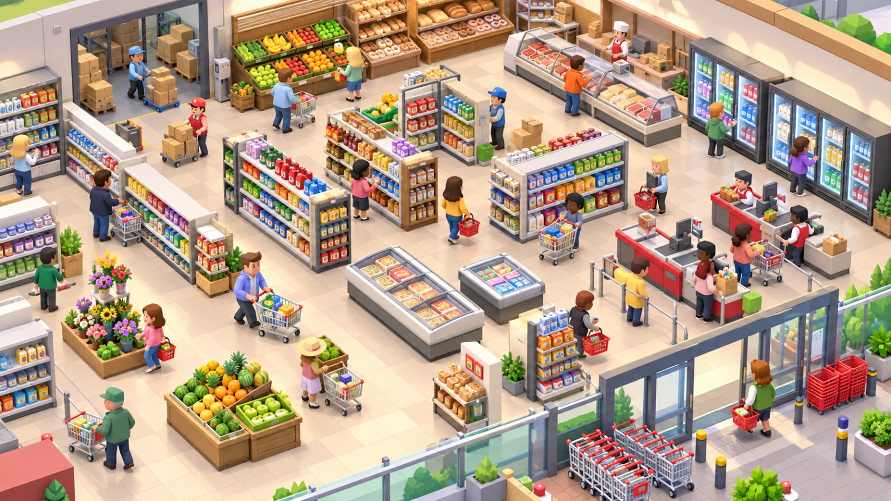

Kullanıcının 28 Eylül 2026'da verdiği bu görsel, oyuncunun marketi oynarken göreceği **gerçek kamera açısı ve final look standardı**dır. Tek bakışta rafları, müşterileri, çalışanları, kasayı ve ürünün stok akışını okuyabilen canlı bir market sahnesi hedeflenir. Yükseltilmiş üç çeyrek kamera, açık dolaşım koridorları, farklı işlevlerin ayırt edilen silüetleri, sıcak ve aydınlık iç mekân, raflarda görünür ürün dizilimi ve müşteri/görevli eylemlerinin aynı karede anlaşılması görsel üretim için öncelikli referanstır.

Görseldeki çok sayıda kasa, soğutucu, şarküteri, ekmek, meyve ve alışveriş arabası **P0 içerik listesi veya yerleşim koordinatı değildir**. Önce kaynakta tanımlı çeşme, şişeleme tezgâhı, domates yatağı, satış rafı, kasa, oyuncu, tek görevli ve müşteri bu okunurluk standardına taşınır; sonraki varlıklar kendi fazı ve katalog kaydıyla eklenir. Stok alma/bırakma görseli yalnız doğrulanmış domain transferini izler; animasyon işlem yaratmaz. Kesin kamera eğimi, footprint, geçit ve mobil performans sınırları anayasa §61–63 ile dünya paftasından gelir. Bu referans, kullanıcı görsel ekleme işlemini tamamladığını bildirince başlayacak dünya varlığı üretiminde birlikte değerlendirilecektir.

### Market progression — Level 1 / 5 / 10 / 20

Kullanıcının ikinci açıklaması aynı marketin küçük bakkaldan büyük süpermarkete dönüşümünün **Level 1, Level 5, Level 10 ve Level 20** görünümlerinde açıkça seçilmesini hedefler. Bu, büyümenin sahnede görünür olması için görsel yönlendirmedir; seviye açılış koşulu, yeni raf/kasa sayısı, ürün erişimi veya ekonomi kuralı oluşturmaz. Gerçek genişleme, etkin modüller ve içerik fazı mevcut kayıt ve dünya paftasına göre ilerler; eski nesne kimlikleri ve konumları korunur.

İkinci mesajda gelen dosya, yukarıdaki **aynı tek market karesi**dir. Dört ayrı seviye paneli veya Level 1/5/10/20 karşılaştırması içermez. Bu nedenle dört aşamanın somut raf, oda, personel ve ürün farkları bu görselden çıkarılmış kabul edilmez; ilerleme kompozisyonu için ayrıca gelecek görsel/açıklama beklenir. Aynı dosya [ana gameplay referansında](./referans_gorseller/ana-gameplay-market-final-look.jpeg) tek kez saklanır.

## Arka alan ilerleme paftası — sekiz görsel aşama

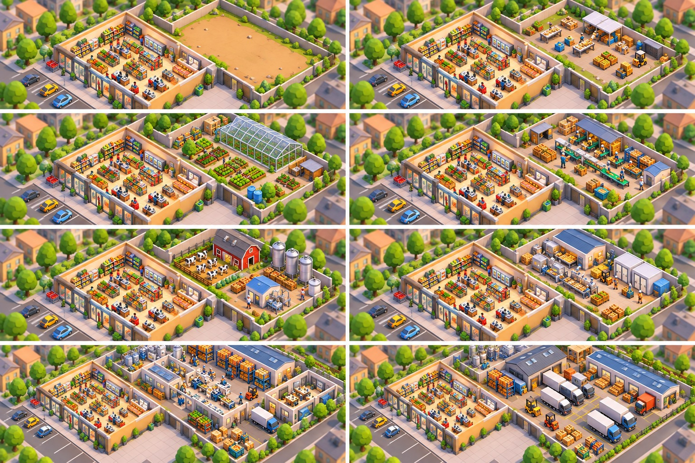

Kullanıcının verdiği sekiz panelli pafta, marketin arkasındaki boş parselin zamanla çalışan bir üretim ve sevkiyat alanına dönüşmesinin görsel referansıdır. Aynı kamera yönü ve öndeki market korunurken değişimin arkadaki alanda okunması önemlidir. Paneller soldan sağa, yukarıdan aşağıya şu görsel sırayı gösterir:

1. Boş arka arazi ve mevcut market.
2. Küçük açık üretim/işleme alanı, tezgâhlar ve kasalar.
3. Tarla yatakları ve sera.
4. Paketleme tezgâhları ve ürün kutuları.
5. Mandıra/ahır ve süt işleme yapıları.
6. Daha büyük kapalı üretim/fabrika bölümü.
7. Marketle birleşik geniş işleme ve depolama alanı.
8. Yükleme kapıları, araçlar ve lojistik merkezi.

Bu sıra **görsel büyüme hedefidir**; sekiz zorunlu oyun seviyesi, satın alma sırası veya mevcut P0 yapılabilirlik iddiası değildir. P0'da yalnız kaynakta tanımlı arka üretim bahçesi ve istasyonları uygulanır. Sera, mandıra, fabrika ve lojistiğin oyun davranışı, ürünleri, erişim fazı, gerçek footprint'i, komşu modül kapıları ve rota kuralları anayasa §58.1 ile dünya paftasındaki kayıtlarına bağlıdır. Yeni parsel/oda açılması eski marketin veya kayıtlı istasyonların koordinatını kaydırmaz; görsel modelin büyümesi gerçek modül durumunu izler.

## Ürün üretim zincirleri — kaynaktan müşteriye

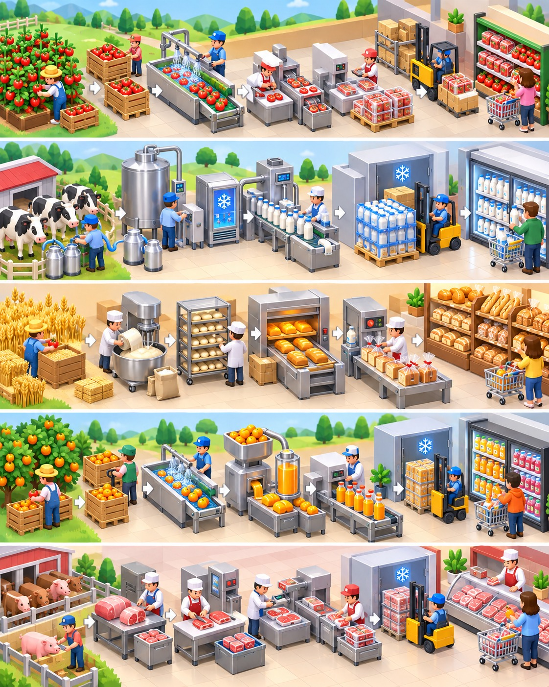

Beş yatay hat, hammaddenin görünür kasaya alınmasından işleme, paketleme, depolama, rafa yerleştirme ve müşteri alışına kadar **fiziksel bir akış** göstermeyi hedefler. Üstten alta domates, süt, ekmek, meyve suyu ve et örnekleri vardır. Domates hattındaki tarla → kasa → yıkama → işleme → paketleme → depo → raf → müşteri sırası oyuncunun istediği açıklık örneğidir; diğer hatlarda da taşıyıcı, makine girdi/çıktısı ve raf durumu birbirinden ayırt edilmelidir.

Bu görsel yeni zorunlu ara istasyon, tarif veya P0 ürün ağacı tanımlamaz. P0 domatesi katalogdaki taze ürün ve gerçek girdi kurallarıyla, su ise mevcut şişeleme tarifleriyle çalışır. Süt, ekmek, meyve suyu ve et hatları ancak kendi kaynak/katalog/faz kayıtları doğrulandığında ekonomiye bağlanır. Hareketli kasa, palet veya paket görüntüsü yalnız gerçek envanter konumunu ve onaylanmış transferi izler; render stok yaratmaz.

## Raf doluluk durumları — stok bir bakışta

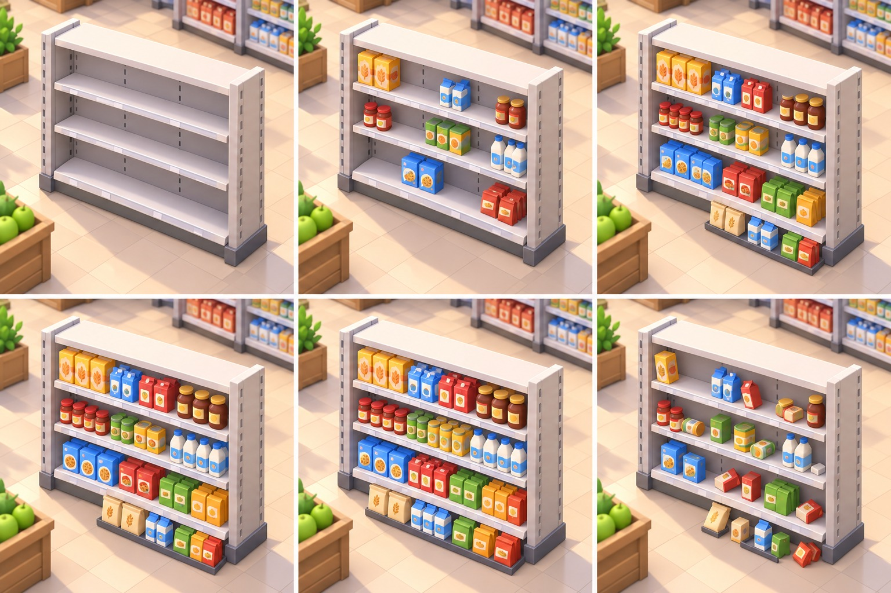

Aynı rafın altı paneli soldan sağa, yukarıdan aşağıya **boş, yaklaşık %25, %50, %75, dolu ve azalmış/dağılmış** görünümü gösterir. Oyuncu rafı seçmeden stok yönetimi gerekip gerekmediğini anlayabilmelidir. Doluluk görseli gerçek raf kapasitesi ve fiziksel lot miktarından türetilir; kısmi durumda boş alan belirgin kalır. Dağınık görünüm, stok gerçekten azaldığında veya tanımlı bir düzen durumu oluştuğunda kullanılabilecek görsel varyanttır; kendi başına kayıp, bozulma veya ceza üretmez. Görseldeki paket çeşitleri P0 SKU listesi değildir.

## Müşteri davranışı — niyet ve sonuç okunurluğu

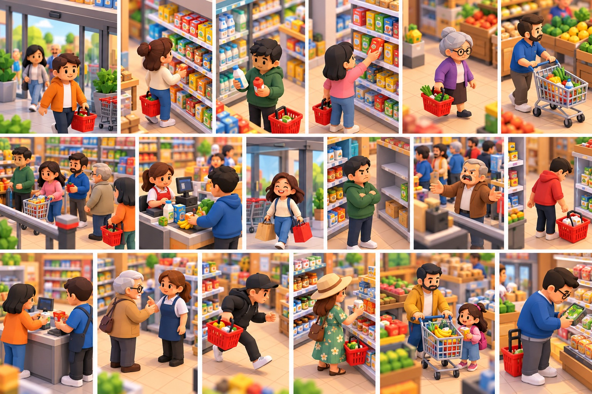

Pafta giriş, raf inceleme, ürünü alma, sepet/alışveriş arabası taşıma, kasa sırası, ödeme, memnun ayrılma, kızgınlık ve vazgeçme gibi durumların **poz, konum, yüz ifadesi ve taşıdığı ürünle** ayırt edilmesini gösterir. Çocukla alışveriş ve farklı müşteri görünümleri gelecekteki görsel çeşitlilik referansıdır. P0'da sahne, tek müşterinin gerçek `CustomerManager` durumu ve gerçek sepet/raf/ledger sonucunu gösterir; bir poz satış gerçekleştiği anlamına gelmez. Ek müşteri profili, refakatçi davranışı veya yeni memnuniyet ekonomisi bu görselle açılmaz.

## Kasa ve sıra — yoğunluk görünür olsun

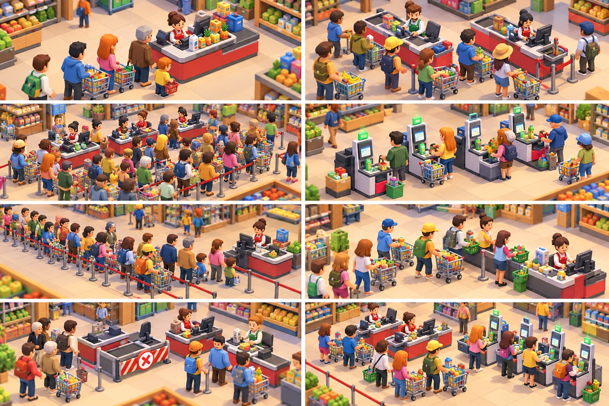

Altı panel bir kasa, iki kasa, yoğun saat, self-checkout, uzun sıra ve hızlı servis görünümlerini karşılaştırır. Kuyruğun başlangıcı, ilerleme yönü, kasanın açık/kapalı durumu ve ödeme noktası tek bakışta anlaşılmalıdır; karakterler servis yolunu görsel olarak kapatmamalıdır. P0 yalnız mevcut tek kasa ve tek müşteri davranışını kullanır. İkinci kasa, self-checkout ve yoğun kalabalık kendi faz ve kapasite kararları gelmeden çalışan özellik sayılmaz. Kasa animasyonu tekil satış transaction'ının sonucunu izler; sıra kısalması sahte satış yaratmaz.

## Tarım bölgesi — üretim alanı ana sahnesi

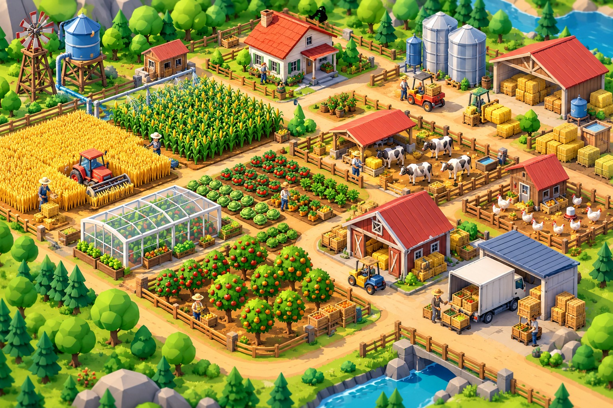

Bu ana sahnede buğday ve mısır tarlaları, sera, meyve bahçesi, sebze yatakları, kümes, inek alanı, su tankı, depo ve yükleme yolu birlikte okunur. Ayrı üretim modülleri arasında yaya ve ürün taşıma rotası görünür kalmalı; çitler ve yapılar servis hücrelerini saklamamalıdır. P0'nun gerçek dış üretim alanı mevcut domates yatağı ve su kaynağıyla sınırlıdır. Diğer alanların açılışı, ölçüsü, kaynak kullanımı ve yol bağlantısı dünya paftası ile ilgili faz kurallarından gelir. Görseldeki göl yeni bir P0 su kaynağı değildir.

## Teslimat ve lojistik — dünya ile marketin bağı

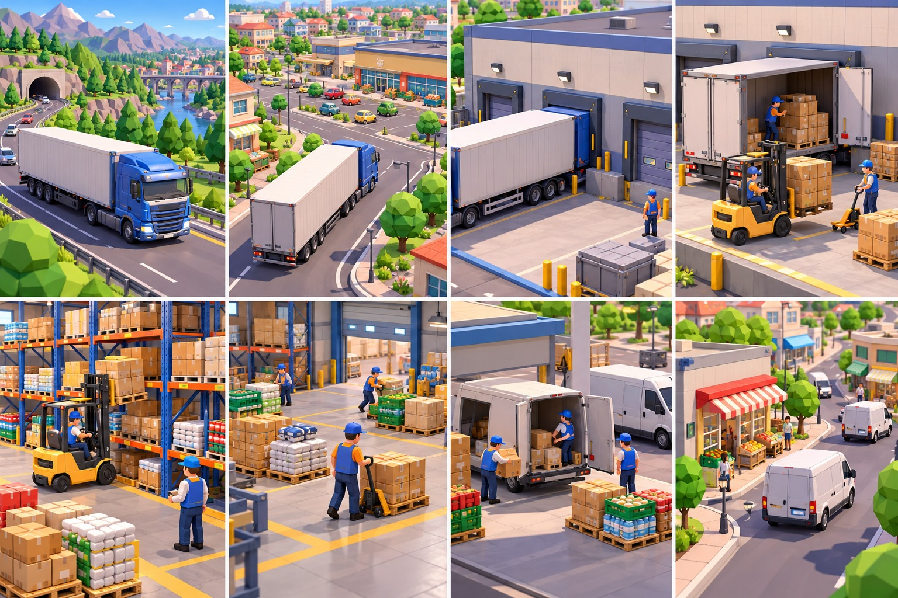

Sekiz panel şehir dışı kamyon yolculuğu → market/şehir yaklaşımı → yükleme kapısı → palet boşaltma → depo rafı → depo içi taşıma → teslimat minibüsü → şehir içi dağıtım akışını görselleştirir. Yol, kapı, palet ve araç konumları world-map ile market sahnesinin aynı fiziksel dünyaya ait olduğunu anlatmalıdır. Görsel araç sayısı, teslimat süresi, tedarik fiyatı veya P0 sipariş sistemi belirlemez; dış alım ve lojistik davranışları kendi fazında açılır. Gerçek ürün hareketi envanter konumları ve dayanıklı işlem kaydıyla eşleşmeden teslimat animasyonu stok eklemez.

### Dışarıdan depoya yerleşim akışı

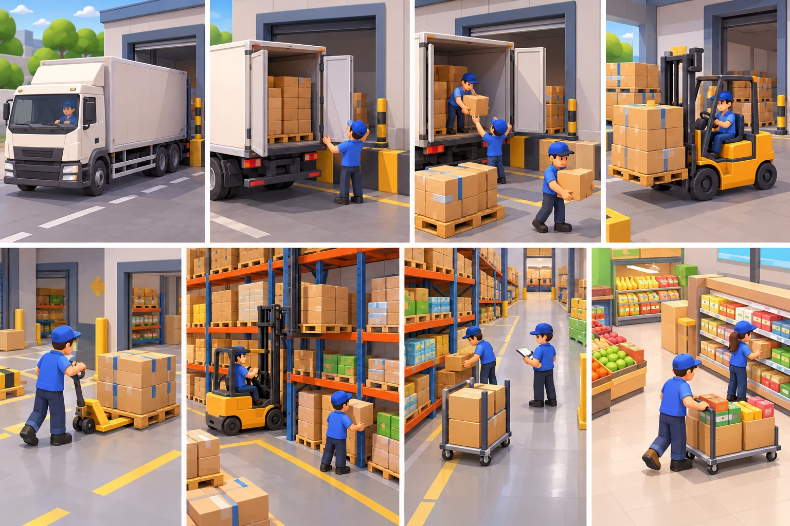

Sekiz yakın plan panel kamyonun yükleme kapısına yanaşması, kapıların açılması, kutuların indirilmesi, paletin içeri taşınması, depo rafına yerleştirme, koridorda ürün doğrulama ve market rafına son ikmali gösterir. Her ara konumun fiziksel taşıyıcısı ve geçerli kapı/rota bağlantısı görünür olmalıdır. Paletin depoya girmesi ile satış rafına konması ayrı envanter konumlarıdır; animasyon tek başına kabul edilmiş teslimat veya satış anlamına gelmez. Bu referans, üstteki geniş lojistik akışının **yükleme kapısı → depo → market** bölümünü ayrıntılandırır; P0'ya dış alım veya forklift mekaniklerini eklemez.

### Depodan mağaza raflarına yerleşim

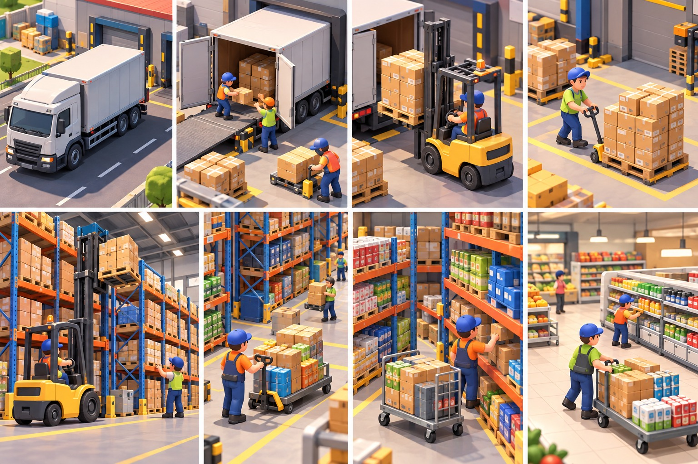

Sekiz panel teslimat aracından palet indirme, depo yüksek rafına yerleştirme, depo rafından ürün ayırma, taşıma arabasına yükleme ve markette satış rafını doldurma adımlarını gösterir. Önceki dışarıdan depoya paftasıyla aynı yolun devamıdır; depo stoku ile satış rafı stoku görsel olarak ayrı kalır. Taşıyıcı ve hedef konumu, kapasite ve rezervasyon gerçek Application/domain akışından gelir. P0'da mevcut tek raf görevlisinin kaynak → yük → raf ikmali bu anlatımın küçük ölçekli karşılığıdır; yüksek depo rafı, forklift veya dış tedarik ancak kendi fazında uygulanır.

## Market, raf ve kasa

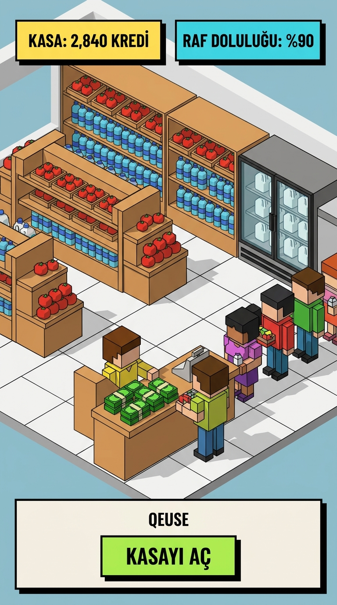

Okunur raf silüeti, açık dolaşım, görülebilen kasa kuyruğu ve ürünün kaynaktan rafa taşınması görsel hedeflerdir. P0'daki gerçek ürünler üç şişe su boyutu ve taze domatestir; ekmek/peynir görüntüsü P0 stoğu anlamına gelmez. Raf içeriği, müşteri alışverişi ve kasa sonucu Domain/Application akışından gelir. Fiyat düzenleme A3 kapsamındadır; sahnedeki etiket veya HUD tek başına fiyatı değiştirmez. DOM/CSS panel ölçüleri [UI tasarım sistemi](UI_DESIGN_SYSTEM.md) ve anayasa §62.1'e uyar: 2–3 px kontur, 3–5 px sert gölge, 6–10 px köşe yarıçapı.

## Üretim istasyonları

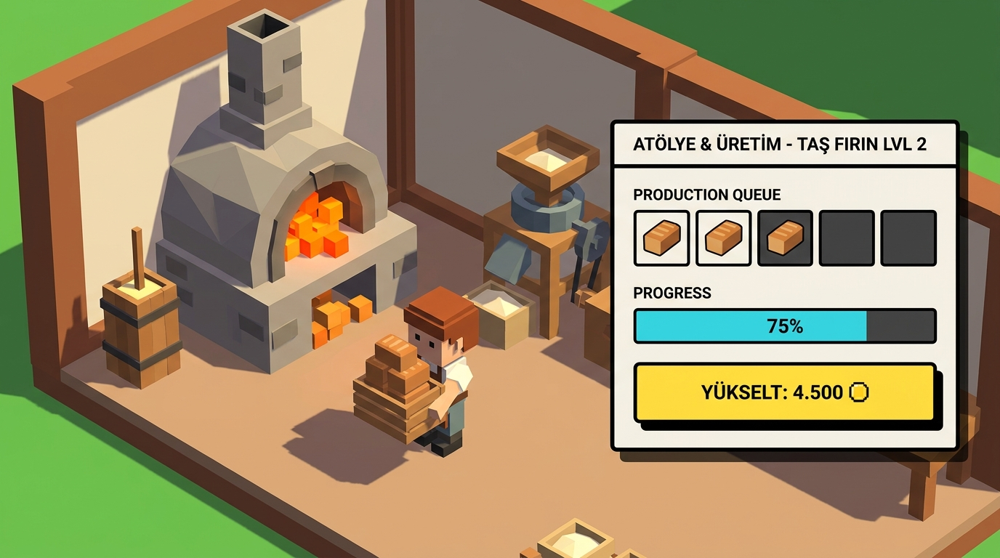

Malzeme, giriş/çıkış portu ve bekleme nedeninin silüetten anlaşılması hedeflenir. P0 yalnız memba çeşmesi, şişeleme tezgâhı ve domates yatağını çalıştırır. Değirmen, yayık ve fırın kendi katalog/faz açılımlarına kadar dekor önerisidir; siyez ekmeği A3 ürünüdür. Üretim kuyruğu, süre ve tıkanma bilgisi [ekran kataloğundaki](EKRAN_VE_MENU_AKISI.md) fazına uygun panelde gösterilir; taşıma animasyonu stok üretmez.

## Bostan, kümes, arılık ve göl

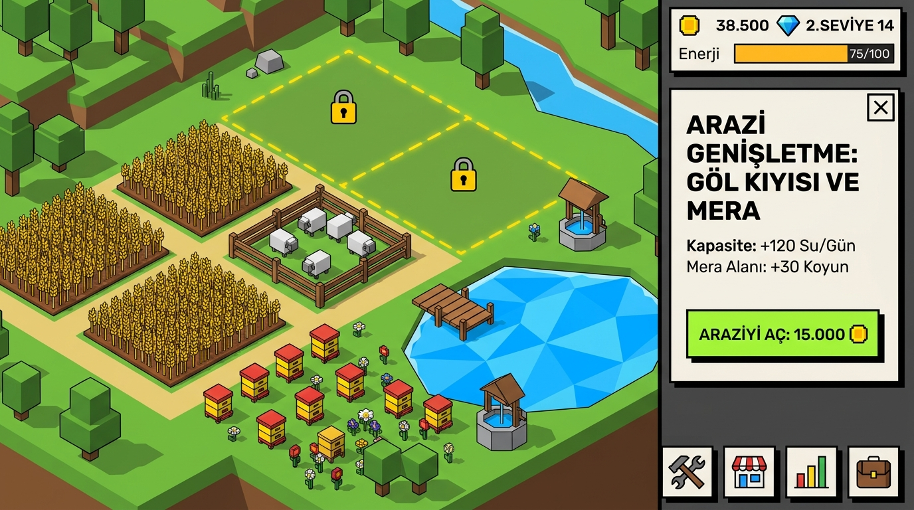

Arazi karakteri, bitki/hayvan ölçeği ve yaya yolları için renk referansıdır. P0 memba çeşmesi gölden ayrı bir kaynaktır. Göl, mera, arılık ve diğer dış alanların gerçek sınırı, kapısı, portu ve erişim fazı [dünya paftasında](DUNYA_YERLESIM_PLANI.md) belirlenir. Eskizdeki kesikli sınır yeni arazi satın alma, kapasite bonusu veya yol açma kuralı yaratmaz. Her ekonomik edinim kendi doğrulama ve kalıcı işlem günlüğüyle onaylanır; 30 aktif saniye yalnız değişiklik varsa checkpoint için üst sınırdır, işlem süresi değildir.

## Gün sonu görünümü

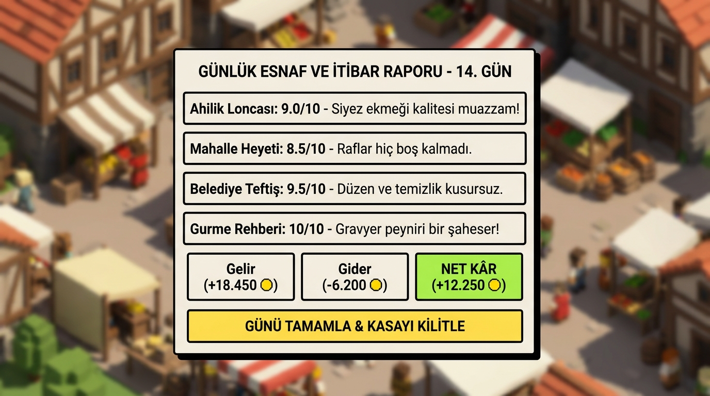

Bu görselin kart yerleşimi ve sayı hiyerarşisi esin kaynağı olabilir. Onaylı akış, A2+ için zorunlu olmayan **Gün sonu** panelidir: nakit, katkı, stok, hizmet, tıkanma ve tek öneri; **Öneriyi incele** ve **Kapat** eylemleri [ekran kataloğunda](EKRAN_VE_MENU_AKISI.md) tanımlıdır. Dört jüri, puan kartı, yeni lonca/kurul sistemi, katalog dışı ürün veya günü bitirmek için “kasa kilitleme” düğmesi bu tasarımın parçası değildir. Oyun günü 900 aktif simülasyon saniyesidir; kritik işlemin dayanıklı kaydı gün sonu paneline bağlı değildir.

## Geniş varlık kataloğu — 15 görsel aile

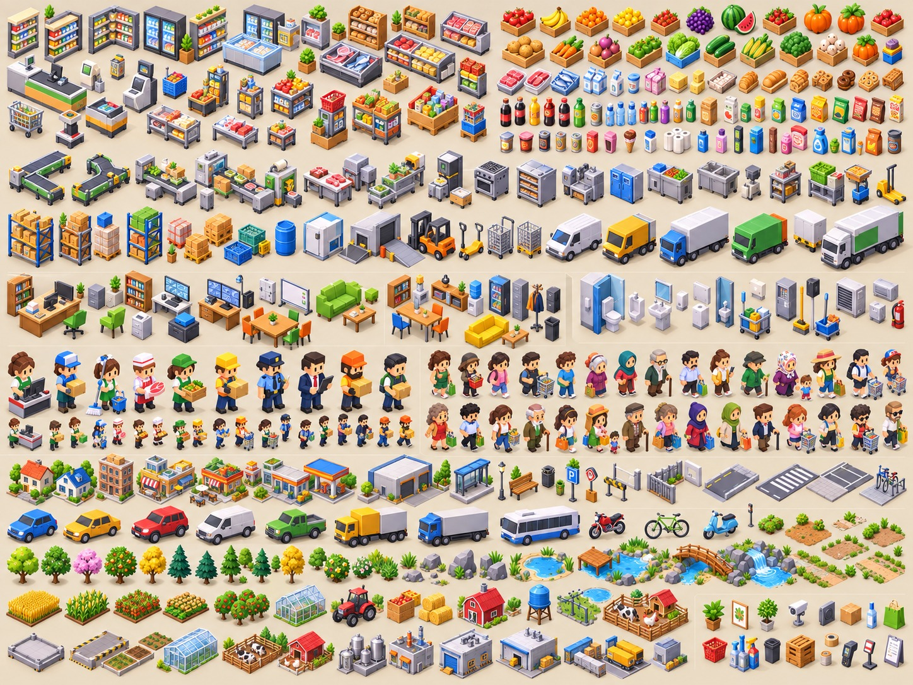

Kullanıcının sağladığı pafta ve aşağıdaki liste, ileride üretilecek **görsel varlık ailesi** için referanstır. İsimler uygulanmış prefab, çalışan mekanik, satın alınabilir nesne veya katalog SKU'su anlamına gelmez. Her ekonomik nesne kendi fazında içerik ID'si, footprint, girdi/çıktı ve kayıt sözleşmesiyle ayrıca doğrulanır. P0'nun ilk görsel üretiminde mevcut çeşme, şişeleme tezgâhı, domates yatağı, satış rafı, kasa, oyuncu, tek görevli ve müşteri önceliklidir.

| Aile | Kullanıcının istediği görsel varlıklar |
|---|---|
| 1. Market içi | Tekli/çiftli/köşe ve duvar rafları; içecek dolabı, dikey buzdolabı, derin dondurucu; meyve-sebze, ekmek/pastane, et ve şarküteri reyonları; kasa bandı, self-checkout, sepet standı, alışveriş arabası, tartı; promosyon, palet teşhir ve küçük impulse ürün standları. |
| 2. Ürünler | Meyve, sebze, et, tavuk, balık; süt, yoğurt, peynir, yumurta; ekmek, hamur işi; içecek, su, meyve suyu, kola, kahve, çay; konserve, makarna, pirinç, bakliyat; cips, çikolata, bisküvi, dondurma; temizlik, kâğıt, kişisel bakım ve evcil hayvan ürünleri. **Kategori farkı yalnız kutu rengiyle değil silüetle de anlaşılmalı.** |
| 3. Üretim alanı | Düz/köşe/splitter conveyor; paketleme, kutu kapatma, sebze doğrama, tartım, etiketleme/paket hazırlama makineleri; et kesim masası, mikser, blender, meyve sıkacağı, hamur yoğurma makinesi, fırın, endüstriyel ocak, ızgara; soğutma ünitesi, dondurucu, yıkama istasyonu, çift lavabo; palet, plastik/ahşap kasa, depo rafı, malzeme kutuları, el arabası, transpalet. |
| 4. Depo ve lojistik | Küçük/büyük depo rafı, paletli ürün, karton/plastik kutu çeşitleri, varil, soğuk depo, yükleme rampası, forklift, transpalet, kargo arabası, teslimat minibüsü, küçük/büyük kamyon, kargo paleti. |
| 5. Ofis/yönetim | Yönetici masası, bilgisayar, laptop, monitör, ofis sandalyesi, ziyaretçi koltuğu, dosya dolabı, kitaplık, evrak kutuları, yazıcı, güvenlik monitörleri, toplantı masası, beyaz tahta, sofa, sehpa. |
| 6. Personel dinlenme | Yemek masası, sandalye, kanepe, kahve/çay makinesi, su sebili, mikrodalga, mini buzdolabı, otomat, personel dolabı, askılık, çöp kutusu. |
| 7. WC/teknik | Klozet, pisuar, lavabo, ayna, sabunluk, kâğıt havlu ünitesi, temizlik dolabı, mop kovası, süpürge, elektrik panosu, havalandırma ünitesi, klima, yangın tüpü. |
| 8. Personel | Kasiyer, raf görevlisi, temizlikçi, kasap, fırın çalışanı, manav, depocu, güvenlik, müdür, teslimat çalışanı. |
| 9. Müşteri | Genç erkek/kadın, orta yaşlı, yaşlı, öğrenci, çocuklu ebeveyn, ofis çalışanı, spor giyimli, başörtülü kadın, emekli amca, turist, aceleci, büyük alışveriş yapan ve küçük sepetli müşteri. Hedef 20–30 temel görünüm; saç, kafa/vücut oranı, kıyafet, aksesuar ve yürüyüş çeşitliliği isteniyor. |
| 10. Dış dünya/şehir | Küçük ev, apartman, mahalle dükkânı, restoran, kafe, depo binası, benzinlik, otobüs durağı; sokak lambası, bank, çöp kutusu, yol tabelası, bariyer, çit, duvar; yol, kaldırım, yaya geçidi, otopark çizgileri, bisiklet parkı. |
| 11. Araçlar | Hatchback, sedan, SUV, küçük ticari, kamyonet, kamyon, otobüs, motosiklet, bisiklet, scooter. Araç türlerinin silüetleri farklı olmalı. |
| 12. Doğa | 8–10 ağaç görünümü, çam, meyve ağacı, çalı, çiçek, çim kümesi, küçük/büyük/dağ kayası, kütük, dere, göl kıyısı parçaları, küçük iskele, köprü, patika, toprak yol. |
| 13. Tarım | Buğday, mısır, domates ve patates tarlası; meyve bahçesi, sera, traktör, tarım kasaları, ahır, saman balyası, su tankı, sulama sistemi. |
| 14. Back-lot genişleme | Boş üretim platformu, makine temel platformu, tarla modülü, sera, hayvancılık alanı, kümes, mandıra, paketleme tesisi, küçük fabrika, soğuk depo, kargo yükleme alanı. Görsel ilerleme için [sekiz aşamalı pafta](./referans_gorseller/arka-alan-ilerleme-8-asama.jpeg) kullanılır. |
| 15. Küçük dekor | Saksı, poster çerçevesi, saksı ağacı, kamera, hoparlör, karton kutu, şişe, poşet, sepet, temizlik malzemesi, çöp, palet, kasa, koli bandı, el terminali, fiyat etiketi standı, alışveriş listesi. |

Personel için istenen hareket ailesi **idle, walk, work, carry, interact**; rol başına en az 2–3 uygun animasyon görsel hedefidir. Animasyon, özellikle ürün alma/bırakma ve stok taşıma anında gerçek Application işleminin onaylanmış sonucuyla eşleşir. 20–30 müşteri modeli ve geniş personel/araç kataloğu P0 eşzamanlı karakter veya performans bütçesini değiştirmez; görünür aktör sayısı ve çizim maliyeti anayasa §63'e göre ölçülür. Kullanıcı referans ekleme işleminin tamamlandığını bildirdi; varlık üretimi faz ve teknik sınırlarla ayrıca yürütülecektir.

## Diğer görsel eskizler

| Dosya | Esin konusu | Uygulama sınırı |
|---|---|---|
| [Oyun HUD'u](referans_gorseller/neo_brutalist_gameplay_hud_1790499395876.jpg) | Sahne ve bilgi dengesi | Anayasa §62 ve ekran kataloğu |
| [Üretim paneli](referans_gorseller/neo_brutalist_crafting_modal_1790499424627.jpg) | Reçete okunurluğu | Gerçek makine/faz kataloğu |
| [Ansiklopedi](referans_gorseller/neo_brutalist_codex_album_1790499454596.jpg) | Şema ve albüm dili | Ayarlar → Oyun Ansiklopedisi |
| [Arazi paneli](referans_gorseller/neo_brutalist_land_expansion_1790499490689.jpg) | Harita bilgi katmanı | Paftadaki sınır ve erişim |
| [Market](referans_gorseller/market_shelves_checkout_view_1790499645665.jpg) | Raf, kasa, müşteri | P0 ürün ve dolaşım sözleşmesi |
| [Atölye](referans_gorseller/workshop_production_view_1790499703023.jpg) | İstasyon silüeti | Fazına uygun gerçek port |
| [Dış alanlar](referans_gorseller/farm_pasture_lake_view_1790499721870.jpg) | Doğa ve yol | Dünya paftası §13 |
| [Gün sonu](referans_gorseller/gamedev_style_report_modal_1790499744547.jpg) | Panel hiyerarşisi | A2+ isteğe bağlı akış |
